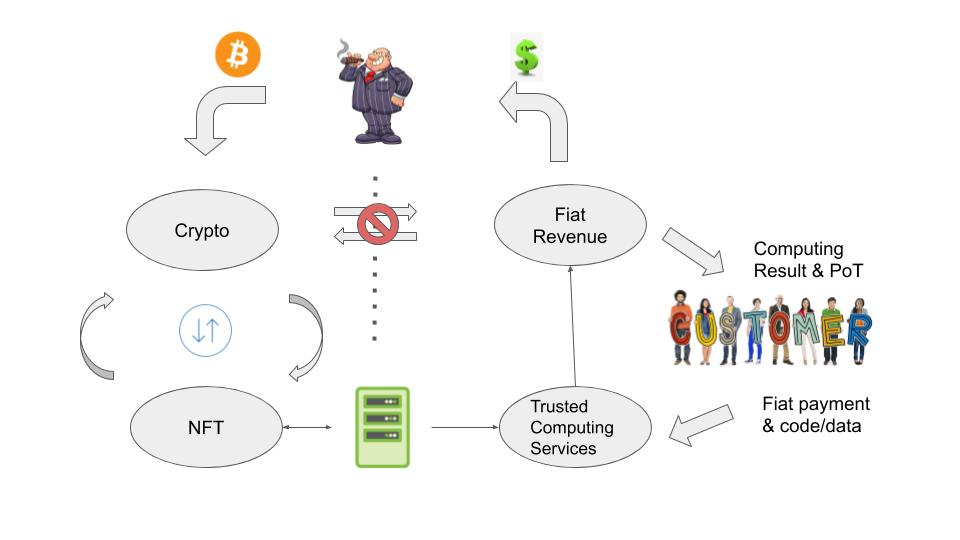
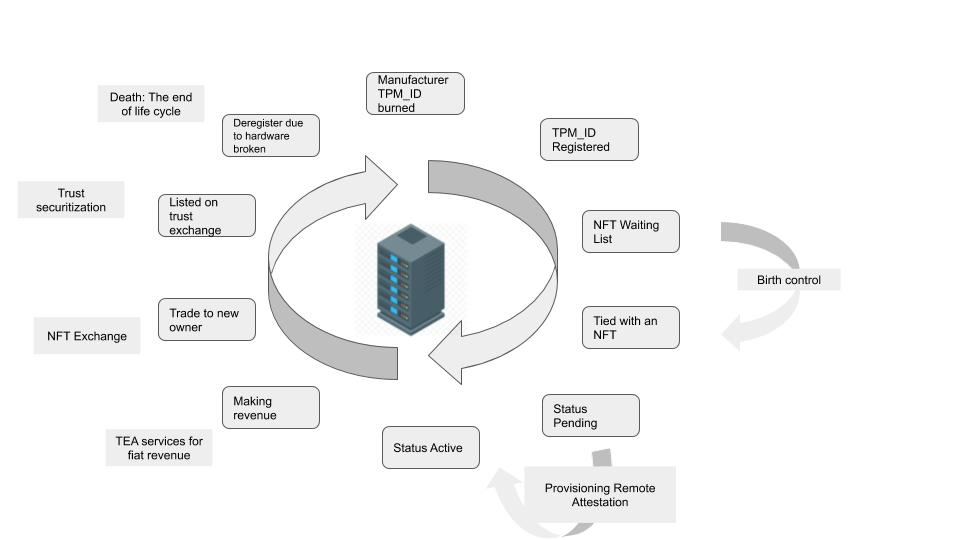

# Decentralised trusted computing services
In our last talk, we went through the technical architecture of the TEA project. Now, we’ll take a look at the business model.

As we mentioned at the end of our last talk, the TEA project can be considered a decentralised computing service that is not owned or operated by any single entity. Anyone can join the TEA network as a miner to provide trusted computing services; it is an open community. Community members offer services and share the revenue. Working together to achieve consensus, ensuring smooth and fair operations for all participants.
Because we shift most of the management costs to the DAO, we don’t need to take a large cut (such as Uber’s 30%) to cover the operational costs. The miners receive almost all the revenue generated from the service. I say "almost" because there is still a minimal cost for so-called "public services" that needs to be covered. 

The public services include bootstrap nodes, an IPFS accelerator, jury duty, general marketing, and more. In traditional human society, this kind of cost is covered by government tax. At TEA we try not to take a cut from our miners. I’ll explain how we cover this cost after discussing the double loop business model.

# Double loops
T-rust has a specially designed double loop which segregates the cryptocurrency loop and fiat currency loop. To prevent any crypto-related legal issues, there is no exchange between crypto and fiat.

Furthermore, the double loop layout provides a way to invest using crypto while gaining revenue in fiat.

Investors use cryptocurrencies like BTC to invest in an NFT (non-fungible token). Each NFT is tied to a unique physical mining machine. This mining machine joins T-rust to run trusted computing services for clients who pay a fiat-based service charge. This fiat revenue flows to the investor as ROI (return on investment).

The NFT's value is determined by the profitability of the mining machine. Every mining machine is unique. Its credit score and performance history determine how much revenue it can generate. The investor can sell the NFT (or part of it) for crypto on the TEA exchange if the value goes up. This is called Trust Securitisation. That means that you can buy a share of a profitable NFT as if it is a company stock.

The trading (buying and selling) of an NFT does not require a physical relocation of the mining machine it is tied to. It is still where it was before, while the ownership is transferred.

This is a new way to invest your crypto while earning fiat legally. This business model is the exact opposite of Bitcoin mining, where you spend fiat to buy machines and pay utility costs, and then mine crypto as revenue. Bitcoin machines depreciate very fast, while T-rust mining NFT’s are designed to increase in value over time as the credit score increases.

# Lifecycle of an NFT: mining machines and social mobility
Community-driven projects parallel human society. A healthy society needs social mobility; otherwise, existing old members will occupy all leading positions and manipulate the rules so that newly joined members (or nodes) won't get the chance to ascend. 

To prevent this, we’ve introduced a life cycle, just like with human beings and all other lifeforms you find in nature. The reality is that every person will die eventually, and while it may sound cruel, it is a driver of the evolution of our society. 

Each TEA node (referred to as NFT) comes with an expiration date, an end of its lifetime. Over time, a machine will break or become obsolete as technology evolves. 

When a TEA node dies, the credit score it has amassed goes with it, similar to the social mobility we see in our society. We do not allow the credit score of a “dead” TEA node to transfer to a new TEA node even if they are owned by the same entity.

# Birth control
While the termination of any existing TEA node is out of our control and in the hands of time, the “birth" rate is carefully controlled by layer-1 smart contracts.

Just like Bitcoin automatically adjust difficulties based on block rates, T-rust adjusts the “birth” rate based on the overall workload of existing T-rust nodes. If there are a lot of tasks in the waiting list, the “birth” rate will increase, and more new nodes are allowed to join the T-rust network. On the other side, if many TEA nodes are idle, waiting for tasks for a while, the birth rate will decrease to protect the profitability of existing nodes.

When there are not enough spots for all the prospective new nodes (let’s say there are 10 spots and 100 miners trying to fill them), the miners in the waiting list will auction for a place in the next selection. This is one way the public services are funded.
