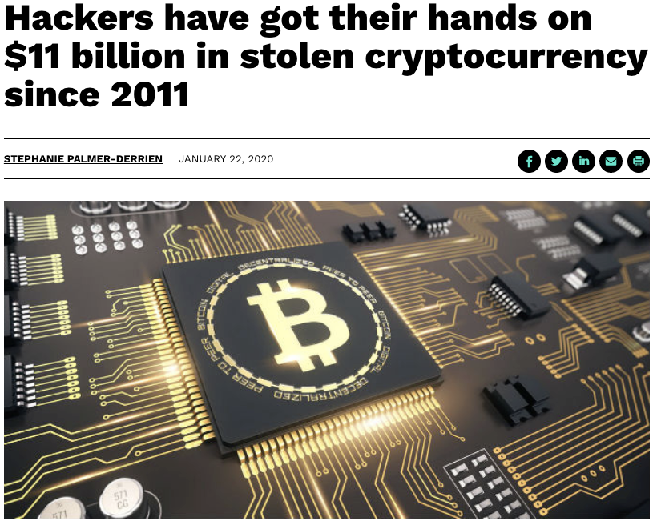
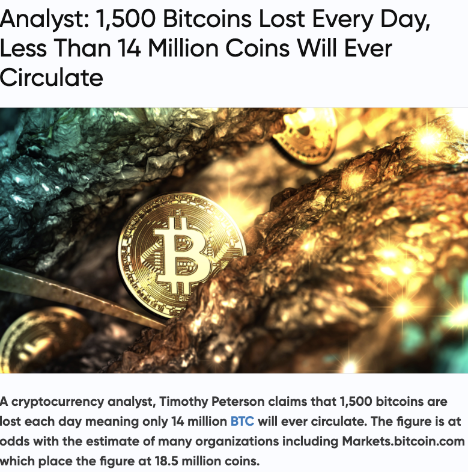
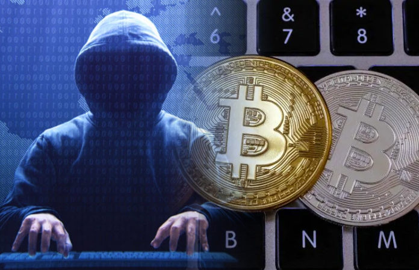
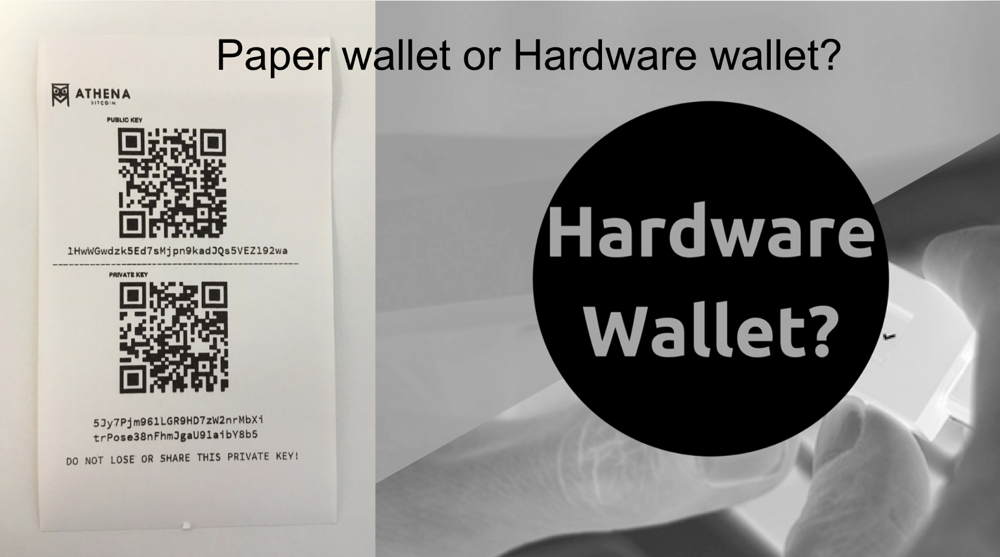
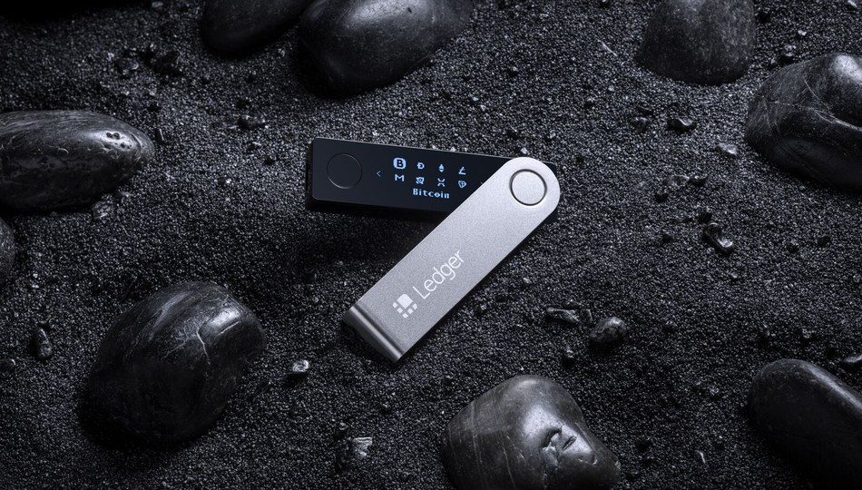
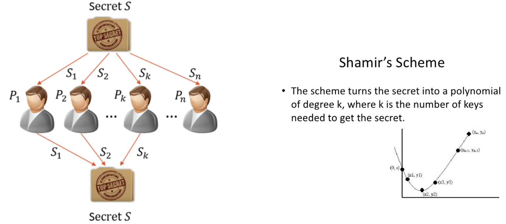
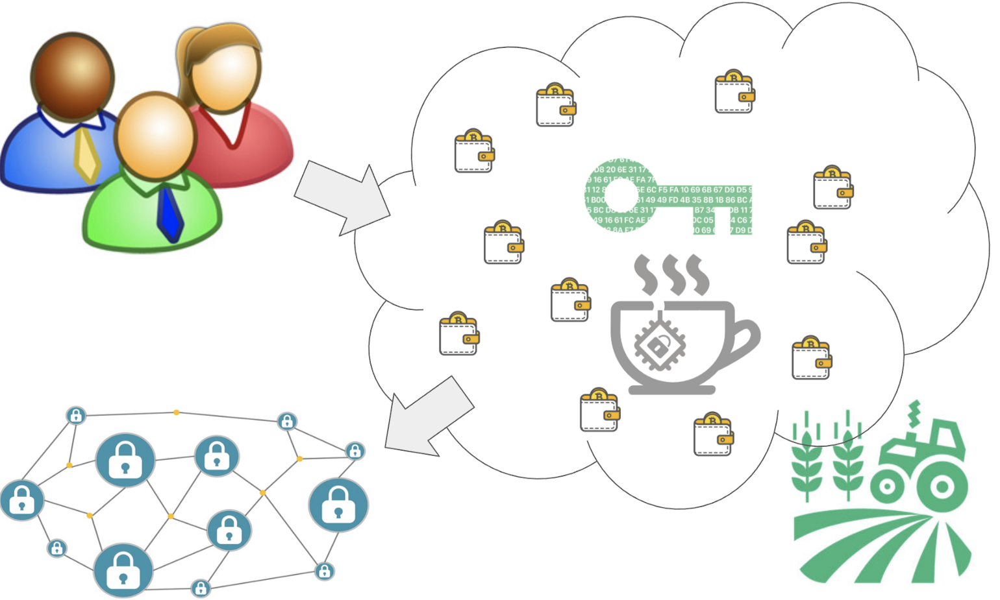
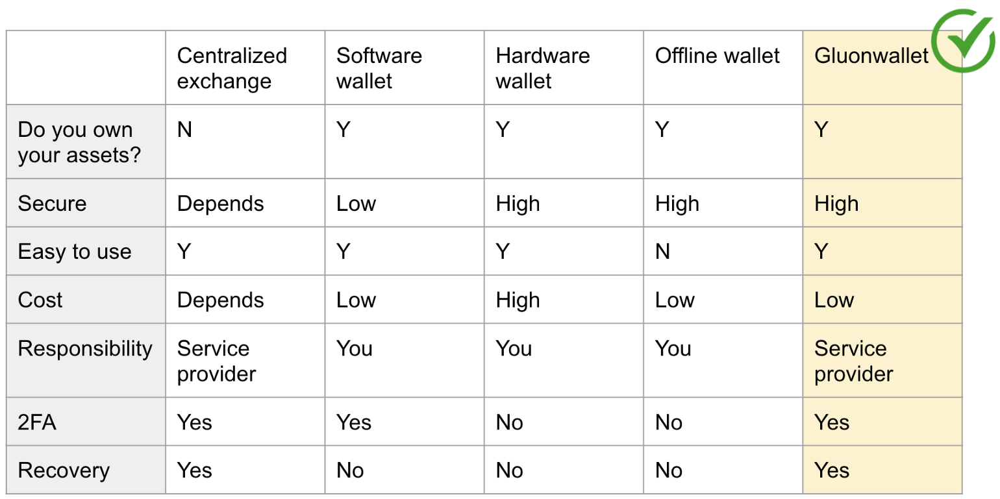
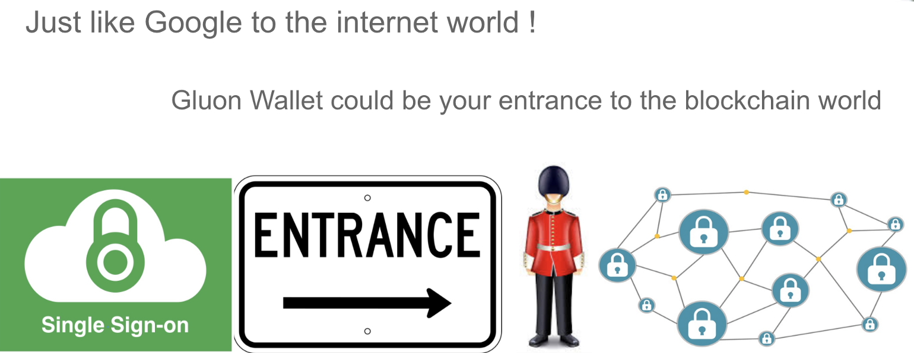

# Gluon Wallet - Can Trusted Computing protect your digital assets?
According to [this article](https://www.smartcompany.com.au/startupsmart/news/hackers-11-billion-cryptocurrency/) posted in Jan 2020,

>Hackers have got their hands on $11 billion in stolen cryptocurrency since 2011.

Just focusing on Bitcoin, according to [this article](https://news.bitcoin.com/analyst-1500-bitcoins-lost-every-day-less-than-14-million-coins-will-ever-circulate/)

>1,500 Bitcoins Lost Every Day, Less Than 14 Million Coins Will Ever Circulate

1,500 BTC EVERY DAY! If we convert that to today’s BTC price (early 2021), it's 27 Million USD a day, or $18709 every minute! When you spend 3 minutes reading my article, do the math and you'll know how much has been lost.

BTC is only one of the cryptocurrencies and cryptocurrency is only one type of digital asset. So you know the amount lost is huge.

## Protecting your private key is the key, but it's also the hardest part

Blockchain technology is very secure by itself. Breaking into a computer or mobile phone is just low-hanging fruit for hackers. Not to mention there are so many phishing attacks that make stealing victim’s private keys so low-tech.

Protecting your private key is your responsibility, unless you give your assets to a centralized exchange. Well, if you do, the only thing you can do is to pray for that exchange. I cannot say the centralized exchange is more vulnerable than your personal wallet, but it is such an attractive target for all attackers. BTW, there is a concept called "monkey business". Good luck!

If you store your private key on your own, you still have a few choices. The strongest but hardest to use is a cold wallet which is usually called a paper wallet. I guess the name comes from that owners write the password down on a piece of paper and not on any digital network-accessible devices to get air-tight protection. Because it's offline, you cannot use it directly. The moment you sign your transaction will be when it's most vulnerable. Please make sure you sign your transactions offline as well. It's cumbersone, no doubt, but that's the only way to be completely safe.

The software or hot wallet is easiest to use, and also the most vulnerable way to store your wallet's secret. Any digital device that connects to the internet has a risk of being remotely broken in to. Do not be fooled by protective utilities, what they do is to make you feel safe.

Using a hardware wallet is so far the strongest solution. It's designed to be safe and offering strong security. As long as you did not buy it from a "monkey business", it should be safe. But wait, how do you know it's not from a "monkey business"? What if someone replaced the unit with a faked unit during shipping? I bet you've heard of package thieves. 

Let’s assume your hardware wallet is genuine, but what if you lost it one day? Of course, you have a recovery phrase, but what if the recovery phrase gets stolen? Anyone who has this phrase can restore your private key unless you're aware of the loss first. Let's imagine that I'm able to buy multiple hardware wallets and store them in different places. As long as I have one of them, I won’t lose my assets. Great, but the more replicas you have, the higher the chance that one of them gets stolen. As long as one of them is vulnerable to theft, your weak login password can hardly protect you. Again, good luck!

## Can I have multiple hardware wallets to share the secret key?

If you're thinking about using multiple hardware wallets to share a secret key, this is an interesting idea that we can explore.

Basically, imagine you cut your 32 byte private key into 4 parts, 8 bytes in each part. Now store each of those parts in four different hardware wallets. Unless all of them get stolen at the same time and by the same thief, the private key cannot be recovered. This sounds secure but what if you lost one of them and you yourself cannot recover it either? So this solution, while secure, is not robust.

This problem can be solved by math. In 1978, the Shamir Secret Sharing Scheme was invented by one of the great cryptographists Adi Shamir. Using this algorithm, we don't need all wallets to recover the secret. As long as we still have **k** of **n** wallets, we can initiate a recovery. You of course want to make sure do not let more than **k** of **n** wallets get stolen at the same time by the same thief. If you're good at math, you can read the https://en.wikipedia.org/wiki/Shamir%27s_Secret_Sharing to learn more. The scheme is not very complicated compared to other modern cryptographic algorithms.

Since any individual wallet cannot recover my secret, do I still have to own them?

Based on our discussion above, any single wallet (or many but less than **k** wallets) cannot recover the secret (in our case, the private key). So why do I still have to buy wallets? They aren't cheap anyway. Can we outsource those hardware wallets to some cloud services that is shared by other users?

Very good point, but just make sure the following security concerns to be considered.

- First, do not let anyone access more than **k** wallets that can recover your secret. So it has to be decentralized. Any centralized cloud services have the power to access all wallets, intended or unintended, or being forced to give them up.

- Second, even it is a decentralized service, all wallets have no incentive to collude. They would have to compete with others by nature.

- Third, every single hardware wallet still needs to be strong enough to resist reasonable attacks although there is no single point of failure (there actually is, we will talk about this later).

- Fourth, If any of the hardware wallets are broken, it can be easily and immediately detected by others so that it can be removed from the network. All secrets need to be recognized to make sure no similar attacks can be spread and cause further damage.

- Fifth, this is non-technical but the toughest part, how can it win your trust?

I'm very happy to tell you that all concerns (except the last one) have been taken care of by the TEA project. Regarding the last one, this will need time to prove.

## Here comes Gluon Wallet on the T-rust framework

If you have read my previous blog posts about the TEA project, you probably already know T-rust is the best framework for doing this. If you're new to my channel, please subscribe and read the historical posts, or simply go to our project website directly http://teaproject.org/#/doc_list/What_is_TEA%3F%2FREADME.md

T-rust is not designed to be a wallet only, but a framework for decentralized trusted computing. Gluon Wallet is the first utility project we built to demonstrate the framework. Every TEA node is a HSM (Hardware Secure Module) protected by a TPM chip. If we load the Shamir Secure Sharing Scheme or other security software into the hardware, it becomes a new generation of the hardware wallet. Any single node is useless and not strong enough, but when they work together on the T-rust framework (like glued by the Gluon), they will become very strong, secure, and robust.

### Sidetrack: What is Gluon in physics.
From Wikipedia:

>A gluon (/ˈɡluːɒn/) is an elementary particle that acts as the exchange particle (or gauge boson) for the strong force between quarks. It is analogous to the exchange of photons in the electromagnetic force between two charged particles.[6] In layman’s terms, they “glue” quarks together, forming hadrons such as protons and neutrons. 
>In technical terms, gluons are vector gauge bosons that mediate strong interactions of quarks in quantum chromodynamics (QCD). Gluons themselves carry the color charge of the strong interaction. This is unlike the photon, which mediates the electromagnetic interaction but lacks an electric charge. Gluons therefore participate in the strong interaction in addition to mediating it, making QCD significantly harder to analyze than quantum electrodynamics (QED).

I am not a physicist, and you probably aren't either. We don'tt have to understand all of the concepts, we only need to believe that the “strong interactions” are the strongest force in the universe.

From Wikipedia:

>In nuclear physics and particle physics, the strong interaction is the mechanism responsible for the strong nuclear force, and is one of the four known fundamental interactions, with the others being electromagnetism, the weak interaction, and gravitation. At the range of 10−15 m (1 femtometer), the strong force is approximately 137 times as strong as electromagnetism, a million times as strong as the weak interaction, and 1038 times as strong as gravitation.[1] The strong nuclear force holds most ordinary matter together because it confines quarks into hadron particles such as the proton and neutron. In addition, the strong force binds these neutrons and protons to create atomic nuclei. Most of the mass of a common proton or neutron is the result of the strong force field energy; the individual quarks provide only about 1% of the mass of a proton.

We want to build the wallet as strong as atomic nuclei that's bound by Gluon.

## The balance between security and ease of use

There is always a trade-off between security and ease of use.

Gluon Wallet sits at the sweet spot that can bring strong security yet ease of use as if it was a centralized service.

Because it's decentralized, you don't have to trust anyone. The only two things you need to trust is math (blockchain) and physics (semiconductor technology). No one, including the builder of Gluon Wallet, the framework developer, the owners of those TEA nodes, or even the government, has the superpower to control the peer to peer network. None of them has your secret either.

Because T-rust is a layer-2 solution, many traditional ease-of-use solutions from the internet era also apply here, such as 2FA, Bio-ID, social recovery, etc. However, they are handled in a decentralized manner, not as centralized as they were in the internet era. Again, no one has control but yourself over your assets.

## The single-sign-on entrance to the decentralized world

Many internet users like me can hardly remember all the different passwords from all websites. We use some utility like 1Password to help us manage passwords. As far as I know, there's no such tool in the blockchain world yet. Gluon Wallet probably is the first one to let you “single-sign-on” (SSO) to other blockchain portal using one universe master password. You can create and store all your private keys to other blockchains inside the Gluon Wallet. You only need one Gluon Wallet private key as master key, then Gluon Wallet can sign transactions for you as if it's your personal hardware wallet, except you will never lose it and it'll never be broken.

Since the single master key becomes extremely important, we can use additional authentications such as traditional 2FA, 3FA, Bio ID, Social Recovery, etc to protect yourself. You can configure the backups based on your risk tolerance level and convenience. You're the boss, you make the call.

So Gluon Wallet could become the single entrance or portal of the upcoming blockchain era, like Google to the internet era.

## Nothing is 100% secure, even for the Gluon Wallet

Nothing is 100% secure. There's always a trade-off between security, cost, and performance. Gluon Wallet could be better than others but can still be destroyed. Just like atomic nuclei can be broken, that is how the first atom bomb was created.

Shamir Secure Share Scheme is the first thing we can improve to increase the security level. Although the secret is split into pieces that each one has no value. They cannot be used if not putting together to reconstruct the private key when signing a transaction. This is the weak point of this algorithm. Newer improvements include using Homomorphism to eliminate the reconstruction phase. That means each private key piece can sign the transaction into a piece of the full signature. 

**K** of **N** pieces of a full signature can reconstruct the full signature without the need for the full private key. One example is called the BLS algorithm. This new algorithm fixed the weak point of the Shamir algorithm but there is a cost. It makes signing much more complex compared to before. The hardest and unresolved part is that the verification process has to be redesigned by our target blockchain. We have decided not to use the new BLS due to performance concerns. I can probably update in future blog posts if we have new ideas later, such as using hardware acceleration or randomness, etc.

Blockchain is not 100% secure either. We strongly rely on the consensus algorithm in our logic. If at a moment hackers can control over 2/3 TEA nodes to collude together, they actually take over the whole T-rust infrastructure. To prevent this, we have three solutions:

- Make the T-rust as big as possible. The bigger it grows, the more expensive to control over 2/3 nodes at the same time.

- Diversify our TEA node’s tech stack so that one hacking skill cannot be used on a different tech stack. This can make 2/3 control even harder. This is also the design principle of the TEA project: we only define the protocol, not the end product.

- Control the “birth rate” of new TEA nodes joining the network. This is mentioned in my previous blog post on the business model of the TEA project.

## Roadmap

Gluon Wallet is a sample application that our TEA Project developers built originally to demonstrate how powerful our T-rust framework can do. After a few internal discussions, I found this application has its own business value so I decided to spin it off as a separate project under its own name: Gluon Wallet.
Gluon Wallet can only run on top of the T-rust framework, the main product by the TEA Project. I believe once the Gluon Wallet is done, and get other developers attraction, there would be more projects to be built on top of the T-rust framework.

Both the framework and application are at an early stage. We are preparing to expose to investors for the first round of fundraising. Funding support from tech communities (such as IPFS, Substrate, etc) is also our first target. We are looking forward to getting more funding and more developers and community supporters to join us. Stay tuned!

