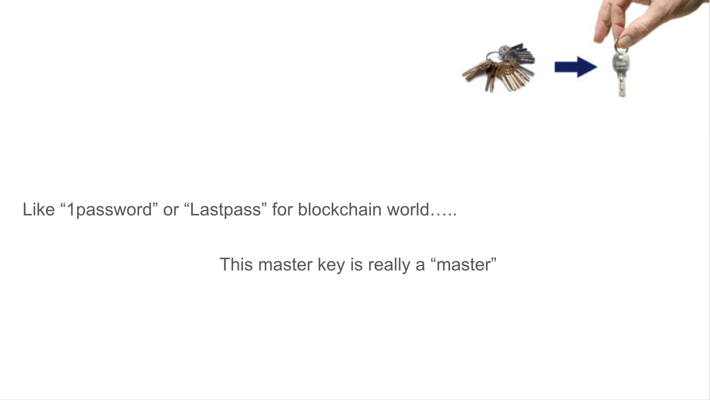
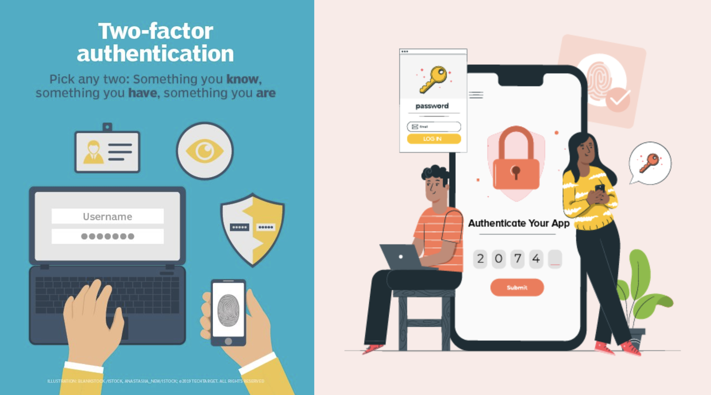
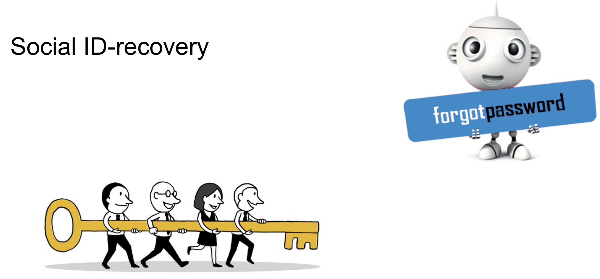

# Gluon (Distributed hardware wallet)— Yet another crypto wallet? Why? What’s new?

You can read my previous blog [Can trusted-computing protect your digital assets](../Can_trusted_computing_protect_your_digital_assets.md) which helps explain what the Gluon Wallet is. After reading it, you can better understand that Gluon is not so much a wallet as it's actually a Trust-as-a-Service (TaaS) application focused on crypto keys.

## "I need a hardware wallet" really means "I need some way to protect my private key"

It doesn't matter what kind of wallet you use as long as you have a secure way to protect your private key. Hardware wallets have caveats that put your digital assets at risk. What Gluon provides a wallet holder is actually a trust as a service. The trust comes from thousands of other hardware wallets although you don't own them. You don't need to trust the owners of those hardware wallets, because they have no access to your secret. As a matter of fact, even you won't have access to your private key!

## What? I do not even have access to the private key as an owner?

Sorry but you do not. You could have a partial key as additional protection (although we don't think it's necessary). Having a full private key in your pocket is actually a bad idea. If you think you have stronger protection than those thousands of hardware wallets, then you probably don't realize what protection means. In my mind, as long as there is a decrypted secret that was ever exposed to any computing device which potentially is able to connect to a network, the secret is no longer secure. The device would have to be particularly designed and hardware protected. So I think it would be more secure to generate and store your private key in Gluon for the lifetime of its use. It should never leave the protected environment even when it's used to sign your transaction.

## The Gluon password is your only master password to the blockchain world

Since all of your private keys to other blockchains are generated and stored inside of Gluon, the only thing you need to remember is the Gluon password. It is actually a standard Substrate blockchain private key. You can use a browser extension, a software wallet, or a hardware wallet.

## Password? Why?

You might feel cheated because you still have to manage a key (password) to use all of your other keys. Aren't we trying to get away from passwords, which are basically exploitable? Don't worry, let me explain.

The Gluon password is not the single method of authentication. You can (and you should) configure your security settings to add 2FA or 3FA to your Gluon account.

Because Gluon is built on top of the TEA project, a so-called "layer-2" solution framework. It can easily be integrated with other modern authentication solutions like OTP, Hardware Authenticator, Bio-ID, etc.

When you use Gluon to sign a transaction, based on your reconfiguration, you will be asked to punch in your additional authenticator’s one-time passkey, face recognition, fingerprint, voice recognition, etc.

Those methods are also used for your Gluon master key recovery along with social recovery. Social recovery means you can preset a few family or friends' accounts. If you lose your Gluon key, you can physically ask them to group sign a transaction to recover your account key.

All these authentications or recoveries are not done in a traditional centralized way. They are handled in blockchain in a decentralized manner. No one can control or force recover your account, not even the government.

## Are there actually hardware wallets running in Gluon?

Internally, we do not call them hardware wallets; we call them TEA nodes. We use hardware wallets because it is a common marketing term that everyone understands. Technically, a TEA node becomes a hardware wallet when the Gluon actor (program) is loaded into it. It's a hardware protected security module (HSM) which works the same as hardware wallets.

## TEA nodes do not work alone, they work together

TEA nodes cannot work alone. They can only work together with many other TEA nodes to get consensuses on just about everything. Because there are many TEA nodes running 24x7 on the peer-to-peer network, you can always get your services you need. Any single TEA node may hold a small portion of your secret that cannot be recovered without consensus with other TEA nodes. Even if they are offline, stolen, burned, or hacked, you won’t lose your secret. This is the methodology of blockchain.

## In what situation, Gluon can get hacked?
There is no 100% security when you still need a little usability and performance. Just like any Blockchain project, Gluon and other TEA projects can be hacked too. But they can only be hacked under the following condition: (assuming Shamir (k,n) algorithm k = 70, n=100)

- Among thousands of TEA nodes (there might be more, let’s assume we have thousands), there are 100 undetermined nodes each holds 1/100 of your private key.

- Hacker happens to hack into 70 TEA nodes of those 100 at the same time and is not detected by TEA’s hardware remote attestation consensus.

Because the TEA node is a black box to everyone, no one knows which of the 100 block boxes among the thousands hold your secret. Hacking into any single hardware protected TEA node is not an easy job, let alone the many different technical stacks used by each of the TEA nodes. Hackers have to use different tools in every case. It has to be completed successfully in a rather short period of time as ongoing key rotations during constant remote attestation may detect the intrusion after a few seconds. I cannot say it's impossible, but I can tell you that it would be very hard and very expensive. As long as it's harder than hacking into your own computer, smartphone, or your hardware wallet, the Gluon wallet is a better choice.

## Where to get more information about Gluon?

I am working on a separate Gluon Wallet project from the main TEA project website. In the meantime, you can get the basic information from [the TEA project website](https://teaproject.org). The TEA Project is actually what Gluon will be running on. Gluon is an application of the T-rust framework by the TEA Project team to demonstrate what TEA can do. So if you understand TEA, you would understand Gluon.

The future Gluon Wallet website will be [Gluonwallet.com](http://gluonwallet.com). Work on the Gluon Wallet is ongoing, please stay tuned.