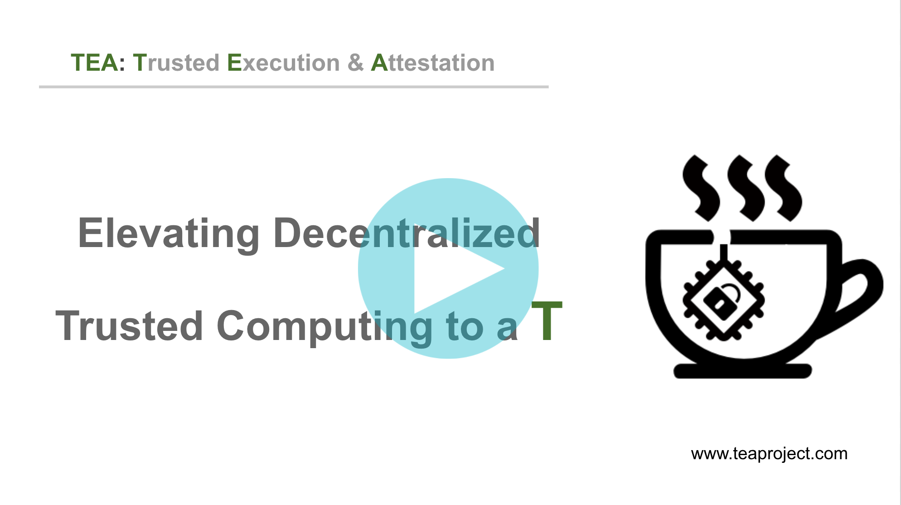

# Blog and Vlog
Click images below to watch videos

- Video introduction

## Current TEA Blog

Our current blog is accessible on [Medium](https://teaproject.medium.com/).

## Earlier Writings on The Beginning of TEA

Kevin wrote about the history of the TEA idea in his [Sweeping Monk blog](https://medium.com/@pushbar) in both [English](https://medium.com/@pushbar/0-of-n-cover-letter-of-the-trusted-webassembly-runtime-on-ipfs-12a4fd8c4338) and [Chinese](https://medium.com/@pushbar/%E7%AC%AC0%E7%AF%87-%E5%8E%86%E5%8F%B2%E6%B8%8A%E6%BA%90%E5%92%8C%E6%8E%A2%E7%B4%A2%E8%BF%87%E7%A8%8B%E7%9A%84%E5%BF%AB%E8%BF%9B%E7%89%88%E6%9C%AC-ecbb558ac36e). At the time the blog was written Kevin had not used the name "TEA". He just called it "Trusted WebAssembly Runtime on IPFS", which he decided was too long and too technical. Soon after, he began using the name "TEA" starting from another blog post of his, [Zen of TEA](https://medium.com/@pushbar/zen-of-tea-1-2480c8c249c3). Reading Kevin's earlier writings about solving computational trust issues with trusted enclaves will help you understand the background of the TEA project.
