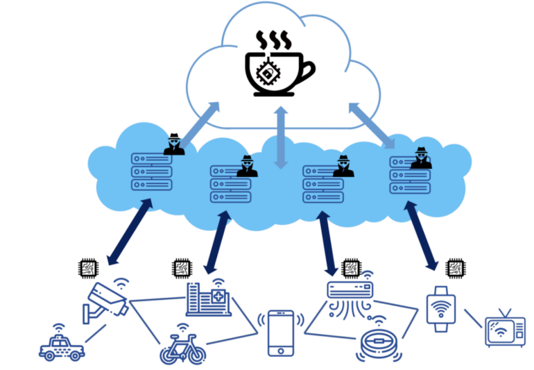

# TEA at Edge - A Trust-as-a-Service (TaaS) Concept

[According to Gartner](https://www.gartner.com/smarterwithgartner/what-edge-computing-means-for-infrastructure-and-operations-leaders/), 91% of today’s data is processed in centralized data centers. But by 2022, about 74% of all data will need analysis and action on the edge.

This is an exciting forecast. But this also raises a concern about privacy protection and security. In the cloud era, data processing resides in a controlled environment like a walled garden. Although the centralized location is a huge bait to attract attackers, the servers are securely guarded by IT professionals. At least you know who to complain to if something goes wrong. However, in the edge era, most of the edge nodes cannot be protected as well as those inside the tech giants’ datacenters. Do you trust them when sending them your sensitive data? Something has to be done to resolve the security concern before we transition into the edge computing era.

There are two layers that need to be protected.

- **The Edge devices**. Sometimes I call them sensors, although not all of them are sensors. They collect data and send it on to edge nodes for processing.
- Edge nodes, who process most of the data coming from those sensors. Only the necessary data or results are sent to the cloud.

First, the edge nodes need to trust that the data coming from the sensors are genuine. Everyone knows the old saying: garbage in, garbage out.

Second, the clients (or the clients who own the sensors) need to trust the edge nodes’ integrity. They do not want breaches to happen to their sensitive data. Compared with heavily guarded data centers, those sparse edge nodes are likely untrustable.

Unlike the traditional computer which is most likely based on x86 architecture running Linux or Windows server, the computers are more variable compared to the cloud era. IoT devices most likely based on ARM or other RISC CPUs. The edge nodes are probably not a traditional server at all. They could be AI processors built with a weak CPU and many strong TPUs or GPUs to handle massive AI processing. A traditional OS might be replaced by SoC or embedded Linux distro. In this case, our existing security protection solutions won’t work.

It ultimately could be easier or harder to protect these edge nodes. On one hand, those devices are usually simpler than traditional general-purpose servers. Smaller, simpler means less available surface for attacks. On the other hand, there might some new way of attacking those new types of computing devices that we don't know of yet.

TCG (Trusted Computing Group) just released the [MARS Use Cases and Considerations](https://media2-production.mightynetworks.com/asset/16767673/TCG_UseCases_MARS_v1p0_r26_30nov2020.pdf) reference book. This is the quote from the introduction:

>Microcontrollers and SoCs supporting embedded and more complex devices are available with many different feature sets. At the high end, microcontrollers may contain sophisticated 32-bit microprocessors, abundant volatile and nonvolatile memories, a large cache, floating point support, protected execution modes, I/O options including support for audio, video, networking and DSP. At the low end, there are microcontrollers with 8-bit microprocessors with minimal additional support. Embedded systems manufacturers, especially those considering use of lower end microcontrollers, may find it difficult to build devices that comply with the TCG’s measurement and attestation (M&A) framework. The Roots of Trust that protect the resources and mechanisms that support measurement recording and reporting are found in a Trusted Platform Module (TPM), but the inclusion in an embedded system of a separate TPM may be untenable due to power, space, and cost. Another solution is needed. The purpose of Measurement and Attestation RootS (MARS) is to specify the means by which microcontroller manufacturers may directly incorporate the required Root of Trust (RoT) logic in their designs in an appealing, lowoverhead manner. The result should be a device that natively supports the “minimum functionality necessary to describe characteristics that affect a platform’s trustworthiness” as required by the TCG [1]. The performance of measuring, recording, and reporting comprise the essential features of a MARS-equipped device

Let’s assume this is one of the solutions, and we can trust the TPM chips as the Root of Trust. In this case the solution could be easy. We need a blockchain-powered consensus between each edge node. They can work together to decide if a particular edge node or IoT sensor is valid or compromised. Because the decision is made by consensus, only a P2P network is required in such a decentralized governance. There is no need for a cloud layer. The cloud layer could be replaced with a blockchain-powered “Trust-as-a-Service” (TaaS) network. This is exactly what the Tea Project is doing. When I design the T-rust of Tea Project, I targeted edge computing security as the main market.

Usually, no matter how big the data is, how complex the computation is, the Proof of Trust (PoT) is relatively small because the PoT contains some hashes from TPM or Blockchain. Verifying the PoT is very lightweight so that it can be handled by blockchain and P2P networks despite blockchain not being able to handle intensive computation. T-rust is such a 3 layered solution that combines blockchain, trusted computing, and IPFS. It runs validation PoT from edge nodes or IoT sensors, issues Decentralized Certificates. I still use certificates only because it is easy to understand. There is no such certificate as what occurs in the centralized world. It's actually a record in the blockchain and it's totally decentralized.

To know more about the T-rust network or TEA Project, please visit https://teaproject.org and subscribe to my channel as well.

