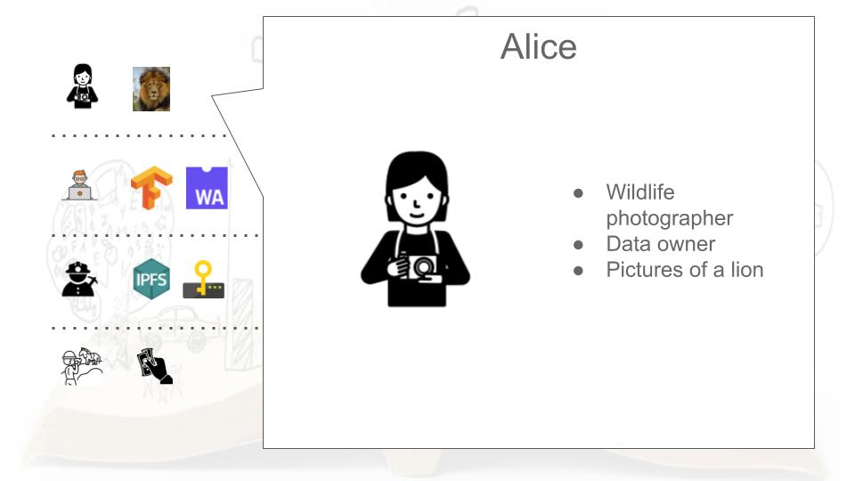
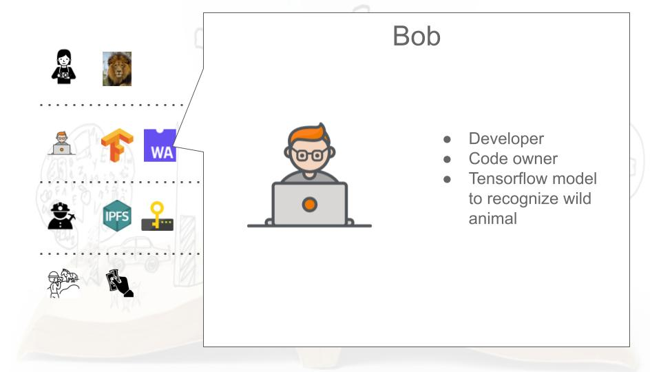
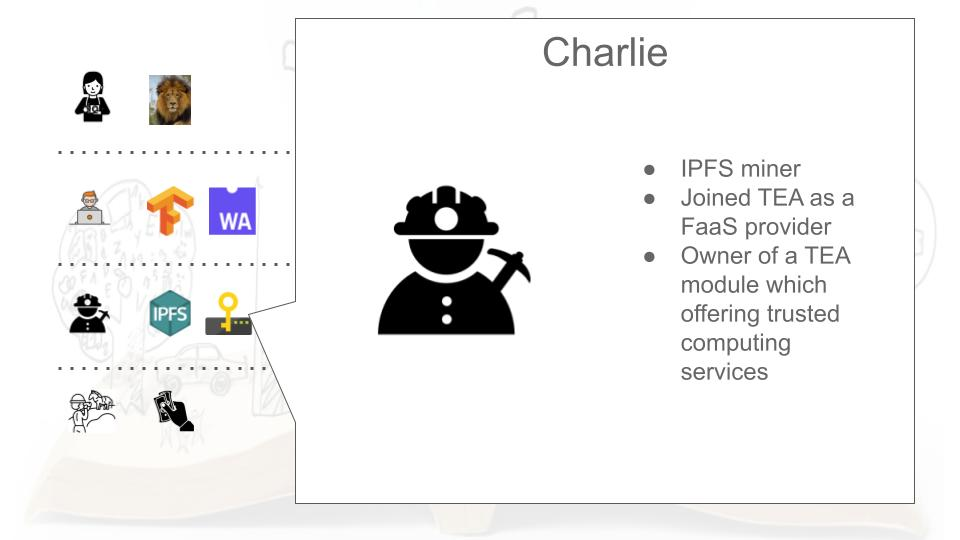
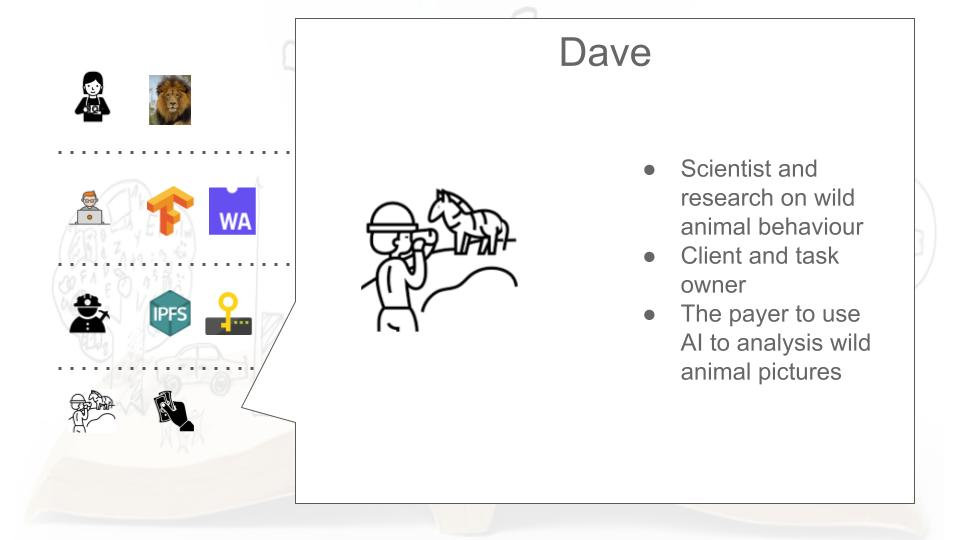
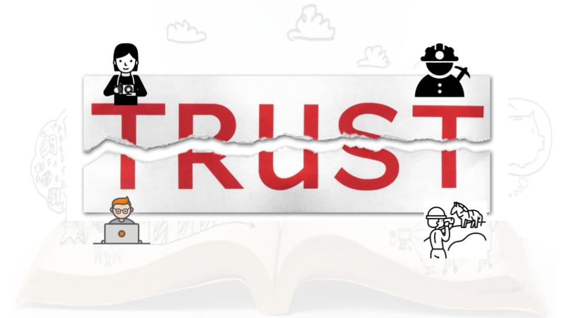
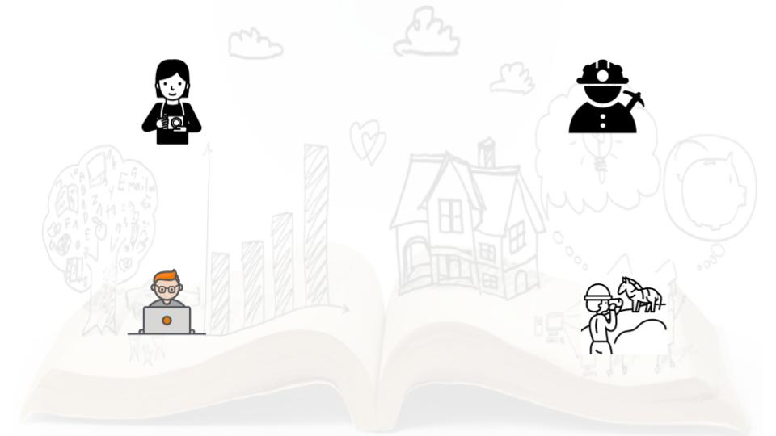

# TL;DR

Watch the demo video before getting your hands dirty...

# The background

Let’s demonstrate how TEA's decentralised trusted computing works with the help of Alice, Bob, Charlie, and Dave.
 

Alice, a wildlife photographer, has recently captured some magnificent images of a lion. Hoping to earn some money, she makes the images available for use on a research platform while also maintaining ownership of the actual pictures.

Bob is a hardcore developer that works on image recognition models. His most recent application is a Tensorflow image recognition model compiled to WebAssembly. He would like to open up his application for use, without creating the opportunity for others to copy his code.

Charlie is an IPFS miner. He’s recently added a TEA module to his device, allowing him to mine both FIL and TEA tokens with the same mining machine. He wonders how the TEA module is able to receive sensitive information from clients and run computations securely and privately.

Dave is a seasoned scientist. He’s currently researching wild animal behaviour by analysing images. While he cannot analyse every picture manually, he can run an AI algorithm on wildlife pictures he’s collected from photographers.

The four characters each play a different role in this story. One common thread is that to do business with each other they require a level of trust that is currently not available.

That's where TEA, a decentralised trusted computing platform, comes in.

These separate parties cannot make deals by themselves as they don't know each other. 

Alice simply uploads her pictures to the TEA platform, which returns deployment_ids for them. Bob does the same with the code for his image recognition application.

Charlie is one of the many IPFS+TEA miners in the TEA network helping to build a trusted computation platform for others to use.

Dave has been running Bob's application for a while and needs some new material to scan. He soon finds Alice’s images and purchases some for analysis.

For Dave, the experience is as simple as paying for the task and receiving the result along with a series of Proof of Trust verifications. And, Alice, Bob, and Charlie all receive their payment.

The execution of Dave's task only takes place inside or between TEA nodes. A TEA node is an HSM, a Hardware Security Module, that's protected by both hardware and a consensus algorithm. No one, including Charlie (a miner and a TEA node owner), can access the information on the module, let alone a hacker.

- Alice gets paid for her pictures, without giving away any files. Bob and Charlie don't get direct access to her pictures. Not even Dave, who's paid to access her pictures, gets a copy of them.

- Bob gets paid for his Tensorflow algorithm without giving Alice, Charlie, or Dave a single line of code.

- Charlie is clueless about any of these activities, and simply gets paid for providing his hardware as a service. He has zero knowledge about the tasks and data that run on his node.

- Dave gets the output he requested, and can verify through the Proof of Trust data that the result is based on the correct code / algorithm and data input.

This is one of the many examples of how decentralised trusted computing with a cup of TEA works!
