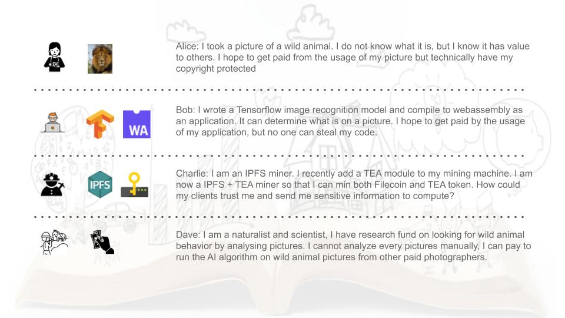
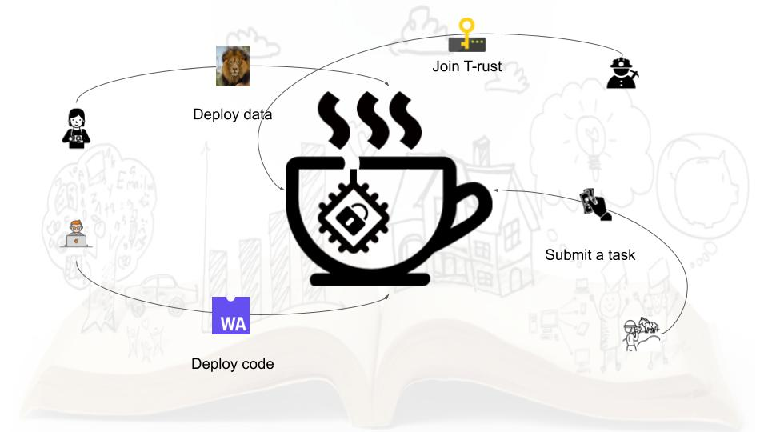
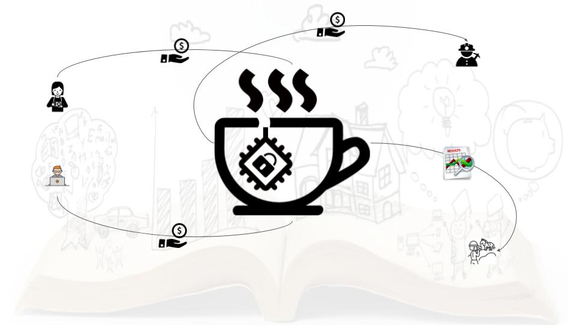
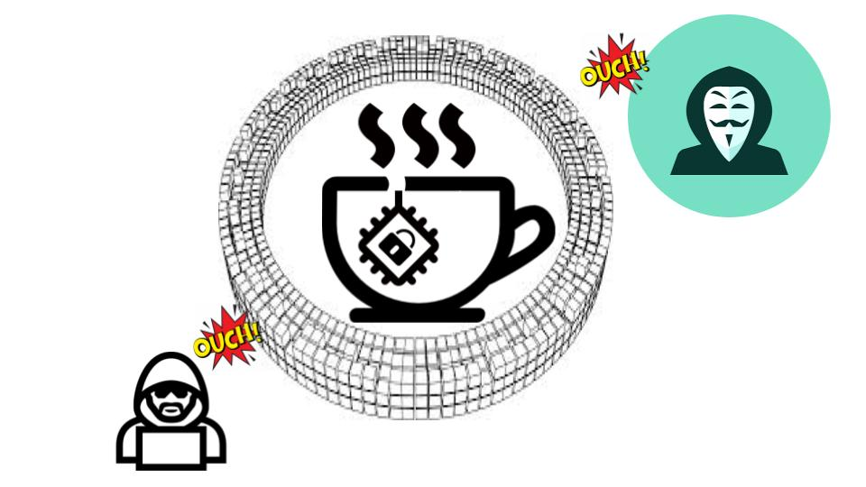

# TL;DR

Watch the demo video before get your hands dirty...

# The background

Let’s demonstrate how Tea’s decentralised trusted computing works with the help of Alice, Bob, Charlie, and Dave.
 

IMAGE:
Alice, a wildlife photographer, has recently captured some magnificent images of a lion. Hoping to earn a couple of bucks, she makes the images available for use on a research platform—while maintaining ownership of the actual pictures.

Bob is a hardcore developer that works on image recognition models. His most recent application is a Tensorflow image recognition model compiled to web-assembly. He would like to open up his application for use, without creating the opportunity for others to copy his code.

Charlie is an IPFS miner. He’s recently added a TEA module to his device, allowing him to mine both FIL and TEA tokens with the same mining machine. He wonders how the TEA module is able to receive sensitive information from clients and run computations securely and privately.

Dave is a seasoned scientist. He’s currently researching wild animal behaviour by analysing images. While he cannot analyse every picture manually, he can run an AI algorithm on wildlife pictures he’s collected from photographers.

The four characters each play a different role in this story. One common thread is that to do business with each other they require a level of trust that is currently not available.

This where Tea comes in: a decentralised trusted computing platform.

Of course, they cannot make deals by themselves; they have never even heard of each other. 

Alice simply uploads her pictures to the Tea platform, which returns Deployment_ids for it. Bob does the same with the code for his image recognition application.

Charlie is one of the many IPFS+TEA miners in the Tea network, bringing trusted computation services to the rest of the gang.

Dave has been running Bob’s application for a while and needs some new material to scan. He soon finds Alice’s images and purchases some for analysis.

For Dave the experience is as simple as paying for the task and receiving the result along with a series of Proof of Trust verifications. And, Alice, Bob, and Charlie receive their payment.

The execution of Dave’s task only takes place inside or between TEA nodes. A TEA node is an HSM, Hardware Secure Module, that is protected by both hardware and consensus. No one, including Charlie (a miner and TEA node owner), can access the information on the module-let alone a hacker.

Alice gets paid for her pictures, without giving away any files. Bob, Charlie, and even Dave do not own a copy of her picture.

Bob gets paid for his Tensorflow algorithm without giving Alice, Charlie and Dave a single line of code.

Charlie is clueless about any of these activities, and simply gets paid for the hardware and services. He has zero knowledge about the tasks and data.

Dave gets the output he requested, and can verify through the Proof of Trust that the result is based on the correct code/algorithm and data input.

This is one of many examples of how decentralised trusted computing with a cup of Tea works!

# Start the demo
Before try any of these demos, please make sure you 
- read the [introduction](http://t-rust.com/#/demo) 
- installed required [extension](../FAQ/how_to_install_polkadot_extension.md)
- [created your own account](../FAQ/how_to_create_a_new_account.md)
- get some free tokens from our [faucet](../FAQ/how_to_get_free_test_token_to_start.md)

In this chapter, you will first try to run a simple "[easy start](Easy_start.md)" demo without deploying anything.

Then you can try to [deploy data first, then run adhoc data](Deploy_data_run_adhoc_code.md).

If that works, try a [reversed version, deploying code first, then run adhoc code](Deploy_code_run_adhoc_data.md).

At the last, you can run [create your own TEA node](Run_your_own_TEA_node.md) to be a miner.
