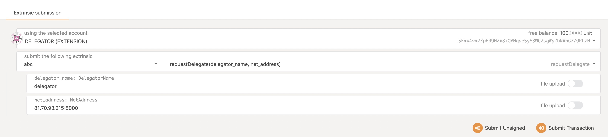
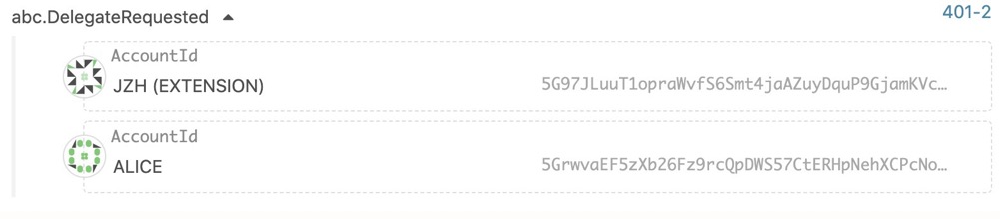
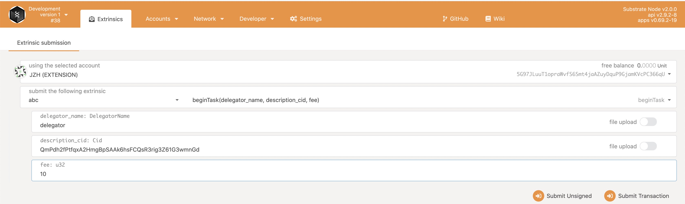
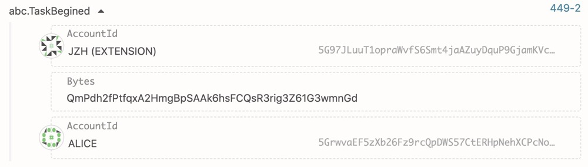
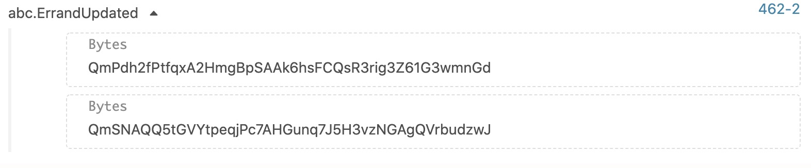

# Substrate demo
This demo will demonstrate how to run privacy and difficult computation tasks using [TEA netwrok](http://t-rust.com/#/doc_list/What_is_TEA%3F%2FREADME.md) from other blockchain.

## Prerequisites

We suppose you have read the [easy start](http://t-rust.com/#/doc_list/%2FTry_the_demo%2FEasy_start.md) and followed the **Prerequisites** in this essay.

And there are also some additional steps:
### Delegator's IP Address

To send a errand task to [TEA netwrok](http://t-rust.com/#/doc_list/What_is_TEA%3F%2FREADME.md), we have to choose a delegator (this is similar to [Select a delegator node]()). Normally you can choose one of the following delegators:

| Delegator Name | Address        | Location |
| -------------- | ------------------ | -------- |
| Alice          | 64.227.57.209:8000 | USA      |
| Bob            | 64.227.57.97:8000  | USA      |
| Charlie        | 81.68.250.243:8000 | China    |
| Dave           | 81.70.96.136:8000  | China    |

If you choose Bob here, please remember the "Address" value `64.227.57.97:8000` and we will use it later. 

### Errand JSON

Remember how we [Confirm the task]() in WebUI of [TEA netwrok](http://t-rust.com/#/doc_list/What_is_TEA%3F%2FREADME.md)? To send a task to [TEA netwrok](http://t-rust.com/#/doc_list/What_is_TEA%3F%2FREADME.md) we should compose a JSON file to describe:

- deployed data we about to use
- deployed code we about to use
- the specific payment plan

And here is an task description JSON example:

```json
{
    "deployed_code": {
        "deployment_id_for_code": "Qmc4Hw1avirJNNSyoic9Nm9q7QRhx55BiiVYu6n85vpjE4",
        "pay_per_use": 3
    },
    "deployed_data": {
        "deployment_id_for_data": "QmVHhgYzxVcWGmQ3s5JVgTTVXXkPtDqvUAhJdJpLewmBEf",
        "pay_per_use": 2
    },
    "deposit_tx_id": null,
    "gas_distribution": {
        "delegator": 20,
        "executor": 80
    },
    "payment": 10
}
```

To short the passing parameters, we should pre-store this JSON into IPFS in the [TEA netwrok](http://t-rust.com/#/doc_list/What_is_TEA%3F%2FREADME.md) and got CID of the JSON file. The following is the CID of the task description JSON above, you can use it directly: 

````
QmPdh2fPtfqxA2HmgBpSAAk6hsFCQsR3rig3Z61G3wmnGd
````

## Compile and start demo

First, use git clone the demo source code:

```shell
git clone https://github.com/tearust/substrate-demo
```

Normally you can use `cargo build` to compile demo, [for some knowing issues](https://github.com/paritytech/substrate/issues/7466) you may got compile errors. We have prepared a compile environment with docker image, you can go into the `docker` directory and use the following command to build from the docker image:

```
./build.sh
```

If compiled successfully, you should see an executable file named "substrate-demo" in `target/debug` directory if you build with `cargo build` command, or in `docker/target/release` directory if you use the `docker/build.sh` shell script (compile with `cargo build --release` command inner). Congratulations, then you should open two terminals and `cd` into the directory contains "substrate-demo" to complete the following steps:

### Start Alice Node 

At the first terminal, run the following commands to run alice node:

```
./substrate-demo --dev --tmp --alice --ws-port 9955
```

Or run following command if you used "build.sh" script to compile:

```
./run.sh alice 9955 --dev --tmp --alice
```

Note that we run with specify a custom web-socket port `9955` (default is 9944), this is because we use the next node more frequently.

If have run the alice node, the following logs should be printed:

```
Nov 28 16:14:57.306  WARN Running in --dev mode, RPC CORS has been disabled.
Nov 28 16:14:57.309  INFO Substrate Node
Nov 28 16:14:57.309  INFO ✌️  version 2.0.0-430329e-x86_64-macos
Nov 28 16:14:57.309  INFO ❤️  by Substrate DevHub <https://github.com/substrate-developer-hub>, 2017-2020
Nov 28 16:14:57.309  INFO 📋 Chain specification: Development
Nov 28 16:14:57.309  INFO 🏷  Node name: Alice
Nov 28 16:14:57.310  INFO 👤 Role: AUTHORITY
Nov 28 16:14:57.311  INFO 💾 Database: RocksDb at /var/folders/5q/dtpwc6qd2dl0vn2c2hg59bm80000gn/T/substrateHn5zYS/chains/dev/db
Nov 28 16:14:57.311  INFO ⛓  Native runtime: node-template-1 (node-template-1.tx1.au1)
Nov 28 16:14:58.234  INFO 🔨 Initializing Genesis block/state (state: 0x102b…1715, header-hash: 0xae01…1981)
Nov 28 16:14:58.261  INFO 👴 Loading GRANDPA authority set from genesis on what appears to be first startup.
Nov 28 16:14:58.512  INFO ⏱  Loaded block-time = 6000 milliseconds from genesis on first-launch
Nov 28 16:14:58.514  WARN Using default protocol ID "sup" because none is configured in the chain specs
Nov 28 16:14:58.520  INFO 🏷  Local node identity is: 12D3KooWHfMp4oTPeM8Wi2BgqXy1pbwkUa9dq72RmPvYAtLpf4r5 (legacy representation: 12D3KooWHfMp4oTPeM8Wi2BgqXy1pbwkUa9dq72RmPvYAtLpf4r5)
```

The lastest logs says the alice node identity is `12D3KooWHfMp4oTPeM8Wi2BgqXy1pbwkUa9dq72RmPvYAtLpf4r5`, and we will use it to compose the bootnode address. The boot node address will be used to start the second node.

**Why** we use two node in this demo? That is because we want to demonstrate the situation that we send a task from a normal node, and collect the task result with authority node (Alice in this demo) to avoid poison data.

### Start a normal node

At the second terminal, run the following command to run a normal node with bootstrap node of Alice.

```
./substrate-demo --dev --tmp --bootnodes /ip4/127.0.0.1/tcp/30333/p2p/12D3KooWHfMp4oTPeM8Wi2BgqXy1pbwkUa9dq72RmPvYAtLpf4r5 --port 30334 --ws-port 9944 --bob
```

If you used "build.sh" script to compile, the following steps need to be executed:

1. run following command to dump IP address of alice node

```
docker network inspect substrate-demo  | grep IPv4Address
```

the dump result may like` "IPv4Address": "192.168.176.2/20",` then the alice IP address should be `192.168.176.2`.

2. run following command with custom alice IP address and  node identity

```
./run.sh bob 9944 --dev --tmp --bootnodes /ip4//tcp/30333/p2p/12D3KooWHfMp4oTPeM8Wi2BgqXy1pbwkUa9dq72RmPvYAtLpf4r5 --bob
```

If this node runs successfully, you should see it sync to the same height as Alice node.

### Prepare the node WebUI

Next we will prepare the node WebUI to read node status and send transactions to the demo nodes, fortunately [polkadot official WebUI](http://polkadot.js.org/apps/) can help us to do this job.

Because we use the default `9944` websocket port for normal node, we can operate node [polkadot official WebUI](http://polkadot.js.org/apps/) without extra configs. 

## Apply delegate

In the Node WebUI we creat a `requestDelegate` extrinsic first. Note there are three parameters:

1. client: account that want to send a task
2. net_address: net address of delegator in [TEA netwrok](http://t-rust.com/#/doc_list/What_is_TEA%3F%2FREADME.md) (you can find it at "Prerequisites->Delegate Net Address" section above)
3. fee: gas fee for the node that help to sent HTTP request to [TEA netwrok](http://t-rust.com/#/doc_list/What_is_TEA%3F%2FREADME.md)

Note: Remember to transfer some token to client account.



If the extrinsic executed successfully, we shoud see logs below. We can see we send a HTTP request to [TEA netwrok](http://t-rust.com/#/doc_list/What_is_TEA%3F%2FREADME.md) and go corresponding response.

```
Nov 28 21:28:42.202  INFO begin to send http post request, url is http://81.68.250.243:8000/api/be_my_delegate?content=CjA1Rktva21YR3dod3I4UjVUWXN5ZFhzcGp4c2dxcDRzZHpRVW1ja1IyMnVUQkMyOVUSAA==
...
Nov 28 21:28:51.646  INFO end of http request (http://81.68.250.243:8000/api/be_my_delegate?content=CjA1Rktva21YR3dod3I4UjVUWXN5ZFhzcGp4c2dxcDRzZHpRVW1ja1IyMnVUQkMyOVUSAA==), response is {"balance":990,"delegator_ephemeral_id":"81702e49c37bc3ac7b2fc4a90f847fe3958b0f3a0d8b8967e91404f65bf12b9e","delegator_tea_id":"2754d7e9c73ced5b302e12464594110850980027f8f83c469e8145eef59220b6","key3_rsa_pub_key":"-----BEGIN RSA PUBLIC KEY-----\nMIIBCgKCAQEAzSkdbd2nqRmWw/9kfYh+/L7yUB69FVFNkGV+EF0887KvZrdhLq7O\nW58tIr0luc059bzYAzTkO+qgriL/rn7tTo4qxeGhoYGyJTC6BY1NamAtUj5SXXfn\nKQmqMLqc7TYUM2oF0aZsCE1Z03c4FThLQNyEYp8Ulr5Yds3P+ODpVuxC+nVUR391\npeM7dtluNECD5F9mnsT2cCB100CEaXdNEDbxJFlORFWMCbYd7GX30FoMWlpZvlLe\nb3/6FSEsfol5Q88XshLEteBPTmBgxHJOFWoVaStQnG8YGAtiZONX4MMkZc8oWZiJ\nTlTzPGKpWir8rfL8eXYkWxdXKYNTOZHRBwIDAQAB\n-----END RSA PUBLIC KEY-----\n","sig":"d738beaba4e41865720020fb50bfdfa771fdc3be862bae14b0a50290a19760046c605639e4a0c9724d94524f1d57022f36ea88e4ed77f8f8ab8ebecc92f01404","tx_id":"deposit_tx_id"}
```

And also we can see an event about the delegate at the Network->Explorer page.



## Send task

Again we creat a `beginTask` extrinsic, and there are three parameters too:

1. client: account that want to send a task
2. description_cid: an IPFS cid to describe the task (you can find it at "Prerequisites->Errand Json" section above) 
3. fee: gas fee for the node that help to sent HTTP request to [TEA netwrok](http://t-rust.com/#/doc_list/What_is_TEA%3F%2FREADME.md)



If the extrinsic executed successfully, we shoud see logs below. We can see we send a HTTP request to [TEA netwrok](http://t-rust.com/#/doc_list/What_is_TEA%3F%2FREADME.md) and go corresponding response.
```
Nov 28 18:31:36.014  INFO begin to send http post request, url is http://81.68.250.243:8000/api/service/5G97JLuuT1opraWvfS6Smt4jaAZuyDquP9GjamKVcPC366qU/6d349d56-8f9e-4029-8766-6b24e2b71fdd/3363383664386639333834336132663666616265626237343762313735363932333332633430373466656265353436353233613164633436366238663339653434633830333733366630613165363964646639643939663434363539663037323034633831303139303833653865323664363061646262366461343036313031?content=QmPdh2fPtfqxA2HmgBpSAAk6hsFCQsR3rig3Z61G3wmnGd    
Nov 28 18:31:36.622  INFO end of http request (http://81.68.250.243:8000/api/service/5G97JLuuT1opraWvfS6Smt4jaAZuyDquP9GjamKVcPC366qU/6d349d56-8f9e-4029-8766-6b24e2b71fdd/3363383664386639333834336132663666616265626237343762313735363932333332633430373466656265353436353233613164633436366238663339653434633830333733366630613165363964646639643939663434363539663037323034633831303139303833653865323664363061646262366461343036313031?content=QmPdh2fPtfqxA2HmgBpSAAk6hsFCQsR3rig3Z61G3wmnGd), response is ok
...
Nov 28 18:32:06.012  INFO begin to send http post request, url is http://81.68.250.243:8000/api/query_errand_execution_result_by_uuid/6d349d56-8f9e-4029-8766-6b24e2b71fdd    
Nov 28 18:32:06.028  INFO end of http request (http://81.68.250.243:8000/api/query_errand_execution_result_by_uuid/6d349d56-8f9e-4029-8766-6b24e2b71fdd), response is {"completed":false,"failed_count":0,"result_cid":""} 
...
Nov 28 18:33:06.009  INFO begin to send http post request, url is http://81.68.250.243:8000/api/query_errand_execution_result_by_uuid/6d349d56-8f9e-4029-8766-6b24e2b71fdd    
Nov 28 18:33:06.022  INFO end of http request (http://81.68.250.243:8000/api/query_errand_execution_result_by_uuid/6d349d56-8f9e-4029-8766-6b24e2b71fdd), response is {"completed":true,"failed_count":0,"result_cid":"QmSNAQQ5tGVYtpeqjPc7AHGunq7J5H3vzNGAgQVrbudzwJ"}
```
And also we can see an event about the task at the Network->Explorer page.



We can see an event about the result of the task at the Network->Explorer page.



Then we can find execute result in WebUI  by specifying description_cid:


You can see the result cid is `QmSNAQQ5tGVYtpeqjPc7AHGunq7J5H3vzNGAgQVrbudzwJ`, the content of cid can be fetched from IPFS server that stored. The execution result should like this:


The `tiger - 58.66%` is the classify result about a image use tensorflow.  

## Resources

Refer to the [substrate_demo_sequence diagram](Run_task_on_other_blockchain_sequence.md), we can get a general idea of the whole process
