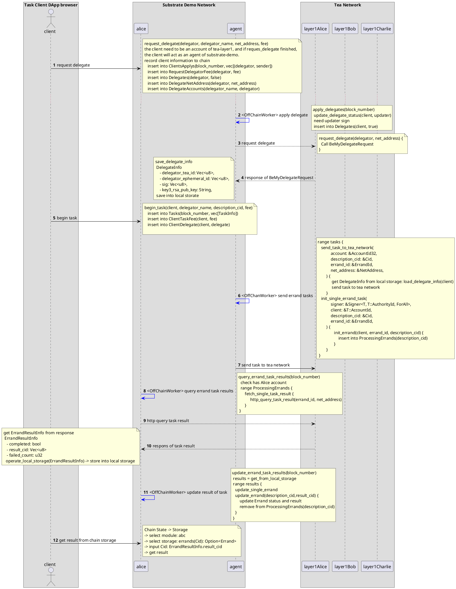

```puml
@startuml
autonumber

box Task Client DApp browser
actor client
end box

box Substrate Demo Network 
participant alice
participant agent
end box

box  Tea Network
participant layer1Alice
participant layer1Bob
participant layer1Charlie
end box

client->alice: request delegate
note right
request_delegate(delegator, delegator_name, net_address, fee)
the client need to be an account of tea-layer1, and if reques_delegate finished,
the client will act as an agent of substrate-demo.
record client information to chain
   insert into ClientsApplys(block_number, vec[(delegator, sender])
   insert into RequestDelegatorFee(delegator, fee)
   insert into Delegates(delegator, false)
   insert into DelegateNetAddress(delegator, net_address)
   insert into DelegateAccounts(delegator_name, delegator)
end note

...

agent-[#blue]>agent: <OffChainWorker> apply delegate
rnote right
apply_delegates(block_number)
 update_delegate_status(client, updater)
 need updater sign 
 insert into Delegates(client, true)
end note

agent-->layer1Alice: request delegate
note right
 request_delegate(delegator, net_address) {
   Call BeMyDelegateRequest
 }
end note

layer1Alice-->agent: response of BeMyDelegateRequest
note left
save_delegate_info 
 DelegateInfo 
    - delegator_tea_id: Vec<u8>,
    - delegator_ephemeral_id: Vec<u8>,
    - sig: Vec<u8>,
    - key3_rsa_pub_key: String,
 save into local storate
end note

client->alice: begin task
note right
begin_task(client, delegator_name, description_cid, fee)
   insert into Tasks(block_number, vec[TaskInfo])
   insert into ClientTaskFee(client, fee)
   insert into ClientDelegate(client, delegate)

end note

agent-[#blue]>agent:<OffChanWorker> send errand tasks
rnote right
range tasks {
   send_task_to_tea_network(
            account: &AccountId32,
            description_cid: &Cid,
            errand_id: &ErrandId,
            net_address: &NetAddress,
        ) {
             get DelegateInfo from local storage: load_delegate_info(client)
             send task to tea network
        }
   init_single_errand_task(
            signer: &Signer<T, T::AuthorityId, ForAll>,
            client: &T::AccountId,
            description_cid: &Cid,
            errand_id: &ErrandId,
        ) {
               init_errand(client, errand_id, description_cid) {
                   insert into ProcessingErrands(description_cid)
               }
        }
 }
end note

agent->layer1Alice: send task to tea network

alice-[#blue]>alice:<OffChainWorker> query errand task results
rnote right
query_errand_task_results(block_number)
  check has Alice account
  range ProcessingErrands {
      fetch_single_task_result {
           http_query_task_result(errand_id, net_address)
      }
 }
end note

alice-->layer1Alice: http query task result
layer1Alice-->alice: respons of task result
note left
get ErrandResultInfo from response
 ErrandResultInfo
   - completed: bool
   - result_cid: Vec<u8>
   - failed_count: u32
  operate_local_storage(ErrandResultInfo) -> store into local storage
end note

alice-[#blue]>alice:<OffChainWorker> update result of task
rnote right
update_errand_task_results(block_number) 
 results = get_from_local_storage
 range results {
   update_single_errand
   update_errand(description_cid,result_cid) {
       update Errand status and result
       remove from ProcessingErrands(description_cid)
   }
 }
end note

client->alice: get result from chain storage
note right
Chain State -> Storage 
-> select module: abc
-> select storage: errands(Cid): Option<Errand>
-> input Cid: ErrandResultInfo.result_cid
-> get result
end note

@enduml
```
