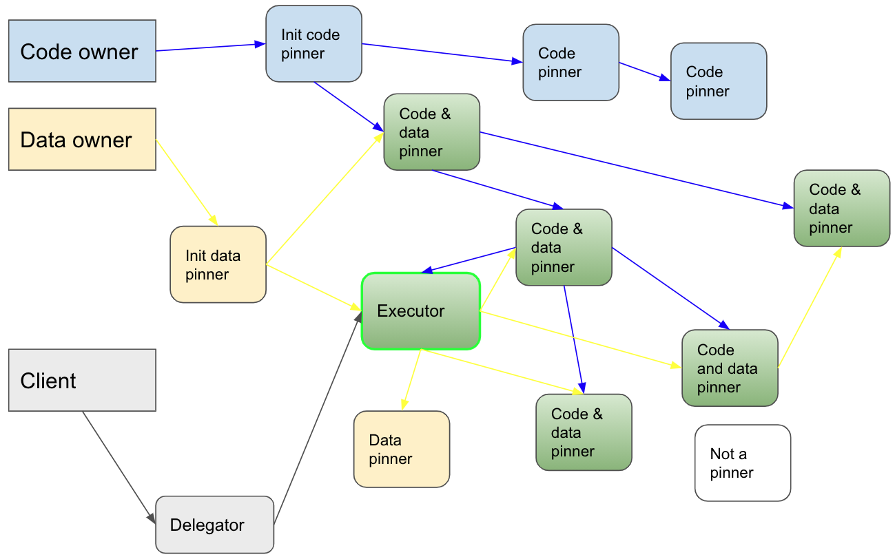
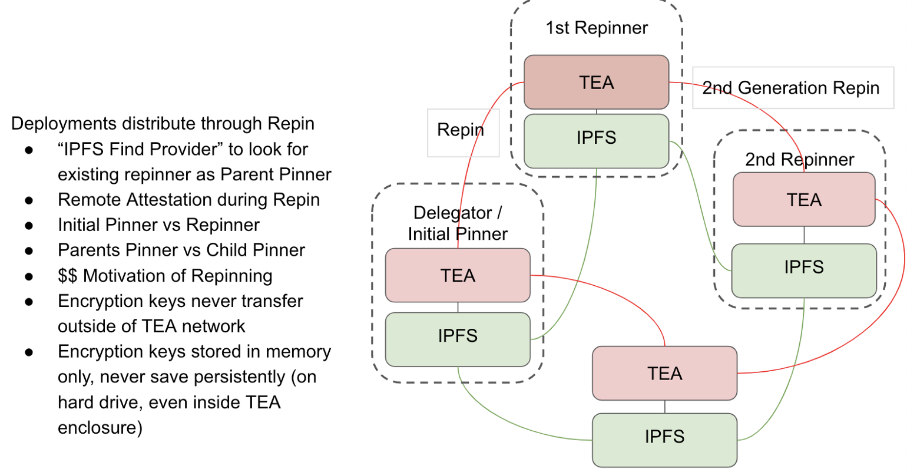

# Pinning and Re-Pinning in Practice
For TEA miners to execute your code and data, it needs to be made available to them in a secure manner. The TEA network's secure transmission of client code and data through its network is called **pinning** and **re-pinning**. Let's look at how this process is kept secure by examining a sample deployment.

## Client Sends Code / Data to the TEA Network

The process of uploading your encrypted data is called **deployment**. Before this  sensitive data leaves your browser, it's encrypted by a random key. Let's call the key **K1**, and the data **D1**. D1, which could also be code, is stored in IPFS securely using an encrypted key. The K1 key will never be exposed to the public. It's either stored inside of TEA modules’ memory without any persistent storage or transferred between TEA modules using secure channels.

## Pin & Repin - Distributing Client's Code / Data Through TEA's Network

The process of distributing K1 is called a **repin**. Any TEA module who owns a copy of K1 is called a **pinner**, and the first pinner is called the **initial pinner** or **delegator**. 

If you own a TEA module yourself, you should select it as your delegator. You can otherwise select any publicly available TEA modules online.

When the initial pinner receives your K1, it will generate a deployment_id for this K1 / D1 pair. You will also get a copy of this deployment_id as it refers to your K1 / D1 pair. The initial pinner will broadcast to the IPFS network (Kad via LibP2P) that it owns this deployment and post an event to TEA's layer-1 blockchain. Other TEA modules either get this information from the layer-1 blockchain or get the deployment_id from other channels (eg. dApps). If that pinner would like to host K1 as well, it becomes a **candidate** pinner. The candidate pinner runs IPFS's DHT findprovs function to find who else pinned this deployment_id. If found, it can ask to be a repinner. 

The current pinner needs to run a remote attestation to ensure the candidate pinner is qualified (the qualification logic can be predefined by the client). Basically, only hardware protected TEA modules can be considered. After the remote attestation has passed, the pinner will send the K1 and deployment_id’s private key to the candidate pinner. Once received, this node is now a legitimate pinner on the TEA network. It can broadcast to the Kad libP2P that it is also a pinner of this deployment_id.
