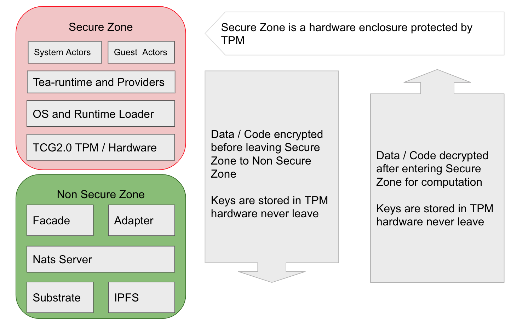

# TEA vs Trusted Computing

The **TEA** in TEA Project stands for **T**rusted **E**xecution and **Attestation**. The TEA Project places great emphasis on **Trust**, as running a dApp on the platform means trusting a remote node where you don't know where in the world it's located, who owns it, what's loaded in its memory and if the hardware/software config is actually what the owner claims.

The ultimate solution involves using cryptography so that you don't need to worry about any of these security concerns. There are some existing software solution, such as [FHE](https://en.wikipedia.org/wiki/Homomorphic_encryption) and [SMPC](https://en.wikipedia.org/wiki/Secure_multi-party_computation). However, they come with a huge computational cost. To be practical, we'll focus on hardware solutions only.

A hardware solution means that the code and data actually run on a remote TEA node that's protected by hardware. The hardware can provide PoT (Proof of Trust) for remote attestation as well as a hardware-protected "enclave" where code and data can run. The former is typically called TPM (Trusted Platform Module) / HSM (Hardware Security Module); the latter is generally called TEE (Trusted Execution Environment).

## TPM and HSM
All these questions need to be done by a remote attestation process. However remote attestation needs **evidence (PoT)** to verify against a **claim**. The claims can be easily queried from the blockchain. But how about evidence? How do you know the proof coming from another node is the truth?

This is one of the problems that trusted computing needs to solve. Another problem is [Data in use](https://en.wikipedia.org/wiki/Data_in_use#Enclaves), which can be solved by a TEE enclave.

The TEA nodes are logically split into two areas. The secure area in red and the non-secure area in green. The non-secure area is not protected, so any sensitive data needs to be encrypted if it ever resides in this area. The secure area is protected so that it's safe for data to be decrypted while it's inside this area. The computation happens inside the secure area as plain, unencrypted data so that it runs in native speed as no FHE or SMPC is needed. 

In the TEA project, we use a typical TCG 2.0 technical stack such as Measured Boot. 

TCG 2.0 is a complicated system, and going into detail here would be outside the bounds of this article. You can easily get more information by reading TCG 2.0 standard [documents](https://trustedcomputinggroup.org/resource/tpm-library-specification/). Another good learning resource is [Google's TPM-js project](https://google.github.io/tpm-js/). 

The PCR stack values are published to the blockchain during the booting process along with its claim. This is so that any other TEA nodes can get this node's PCR stack by regenerating the PCR stack from the claim. This allows any TEA node to verify if any particular TEA node's claim matches the truth. This is one essential feature TEA uses for remote attestation. Besides this feature, we also use VRF to select multiple remote attestation nodes as a [BFT](https://en.wikipedia.org/wiki/Byzantine_fault) committee to make the group decision. 

## TEE

TEE is a very different approach. It makes the protected area even smaller, into a small part of the RAM and inside the CPU chip. We can use Intel SGX as an example.

All sensitive data is decrypted and processed inside the small area called **enclave**. Even the OS has no access to it because the encryption key is inside the CPU hardware. In this case, the trust and protection come from the CPU manufacturer. In most cases, we have to trust the CPU although there are always a few exploitable vulnerabilities to be found. 

Given the trust comes from the CPU manufacturer, the remote attestation is easier since it's centralized—the difficulties are transferred to the dApp developers. Due to limited resources inside the enclave, the developers need to figure out which function to run inside of the enclave to gain security and which functions to run outside of enclave to gain performance. Security and performance are always a trade-off.  

## When to Use TPM, and When to Use TEE?

The TEA Project supports both TPM/HSM and TEE solutions as the source of trust. Which solution a TEA node to choose depends on the specific use case.

Not all CPUs have a TEE feature. Some special-purpose computers usevspecial chips that may not be a general-purpose CPU. For example, AI requires GPU or TPU rather than a CPU. Smaller low power IoT device may use low-power CPUs that do not support TEE. in those exceptional cases, TPM/HSM is the best solution.

On the other hand, a general-purpose computer is usually equipped with x86 / ARM CPU which either supports Intel SGX / AMD-TEE or ARM Trustzone. Most of these machines also have a built-in TPM. So some combination of TEE / TPM can be used in this case. 

No matter which solution the TEA nodes chooses, the majority of the workflow is the same. The only differences are the remote attestation workflow and how the WASM code is loaded into the CPU. 

When a client submits a computation task, he can claim the requirement in the  JSON description file. For example, if this task is an AI task, a TPU is required. The Capability-checker will ensure only capable TEA nodes "host" this dApp and execute the code.

