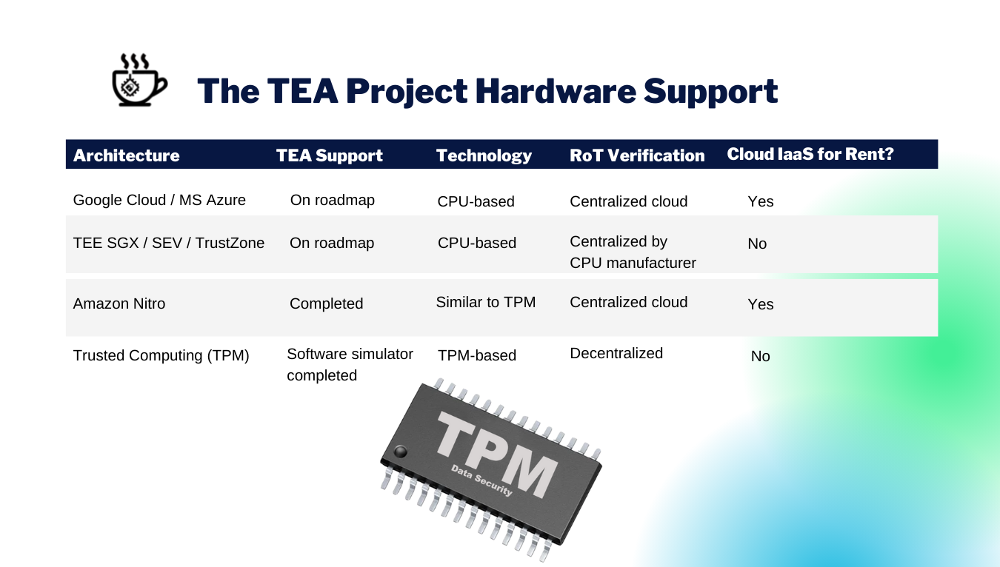

The primary objective of the TEA Project's layer-1 is to maintain the trusted status of all nodes on layer-2.  These nodes that gain trusted status through attestation on layer-1 no longer have to ensure Byzantine Fault Tolerance (BFT). 

The apps can run full speed on layer-2 once trust among nodes can be taken for granted. This is in contrast to traditional blockchain apps which, because they run on the blockchain directly, need to perform BFT consensus. This is a roadblock for traditional blockchain apps looking to perform at scale while maintaining decentralization and security.

## Leveraging Hardware Security Modules for Trust

The TEA Project works with existing secure hardware technologies like the Trusted Platform Module (TPM) and Intel's SGX to add a trusted layer to its blockchain. Each node on the TEA network must have a hardware security module (HSM). To be able to run decentralized apps and execute code, these decentralized nodes must pass remote attestation when queried by existing trusted nodes on the network.

The remote attestation process queries the embedded HSM on the candidate node, and its embedded HSM (such as a TPM chip) will respond to the query. If the result is as expected, then the candidate node gains trusted status. The result of the remote attestation process is stored on the blockchain.

Once a node is trusted, it can carry out computations for TEA Project apps within its secure enclave. The TEA Project's major premise regarding trust is that if we can trust the the node through remote attestation, we can trust the integrity of its secure enclave to run code and process data in a way that's secure and zero-knowledge.

## TEA Project Hardware Support

The TEA Project's roadmap for supporting various Root of Trust (RoT) verification chains depends on the underlying hardware.

