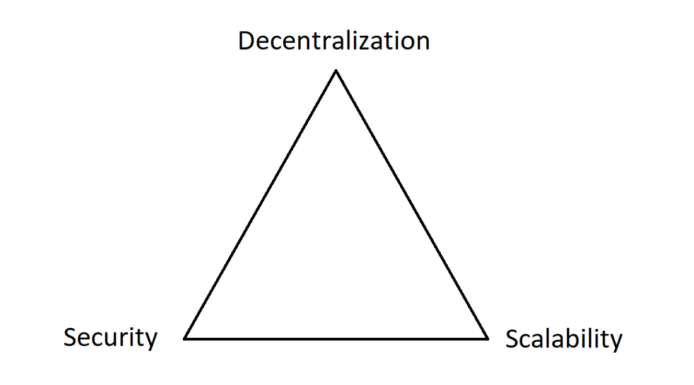
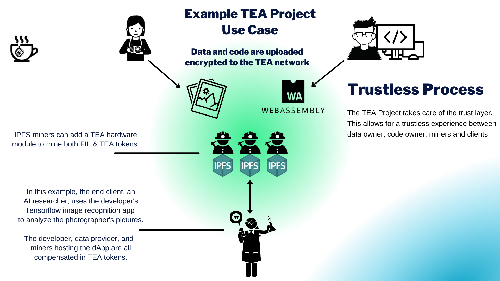

# 1. Overview
# 1.1 How the TEA Project Solves an Essential Need of Web3

The TEA Project provides a platform where rich, decentralized applications can run at native speeds across a decentralized network of computing nodes. It solves the Blockchain Trilemma by offering a scalable, decentralized, and secure blockchain without compromising any aspect.

The TEA Project builds on many emerging projects and paradigms which in and of themselves are not sufficient to solve the Blockchain Trilemma. Blockchains like Ethereum provide a world computer where smart contracts can run in a decentralized manner. They are further augmented by Web3 innovations like IPFS, a peer-2-peer file system that stores files decentralized. But smart contracts by themselves cannot currently run complex algorithms. Attempts to do so have shown smart contracts to be too slow or too expensive as they lack the processing power compared to modern cloud computers. A layer-2 solution would be needed to offload the computation tasks as long as it could provide a similar trust level as the layer-1 blockchain. By combining blockchain with IPFS and trusted hardware (TPM and GPS modules), the TEA Project achieves scalable speed without compromising security or decentralization. 

## TEA’s Biggest Innovation is Trust

In the TEA Project, computing nodes become trusted through a remote attestation process. These trusted nodes can now store and transmit sensitive information and securely run WebAssembly code. The concept of trusted computing has so far been stuck in the limiting paradigm of one-computer = one-metal-box. This old thinking limits its expansion and possible uses cases in a distributed world. It needs the help of blockchain and other emerging technologies to expand beyond its current barriers. In particular, it needs a solution like the TEA Project to make a decentralized network of mining nodes trustable without sacrificing app execution speed.

## Byzantine-fault Tolerance Leads to Slow Processing 
No matter how many nodes are running in a typical blockchain system, the one-by-one ordered transaction queue of existing Byzantine fault tolerant (BFT) consensus algorithms leads to slow data processing times. Smart contracts currently cannot run complex algorithms. Attempts to do so have shown smart contracts to be too slow or too expensive as they lack the processing power of modern cloud computers. 
Existing blockchains are slow because they need BFT to reach consensus. They could host dApps that reach the speed of cloud computers if only they had trust. Trust is exactly what the TEA Project is able to provide through its 2-layer blockchain design.
We don't yet have rich dApps running at cloud-speed on blockchains since these systems need consensus to guard against a trust-less environment. Cloud computing gives you rich and fast apps, but it's not decentralized and you must assume their ecosystem is trustable.

# 2.1 How the TEA Project Delivers Decentralized, Secure, and Scalable Apps
In the TEA Project, trust is already taken care of by our layer-1 blockchain. That allows our layer-2 nodes to all trust each other by default and no longer need to watch for Byzantine faults. The TEA Project’s decentralized apps can run as fast as cloud computers who are able to take their trustable (centralized) nodes for granted.

## Decentralization
The TEA Project’s decentralized TApps run on decentralized miners that connect to each other through a peer-to-peer network. Every TEA node is protected and monitored by hardware TPM chips or the CPU's TEE (Trusted Execution Environment) which provides PoT (Proof of Trust) data. 

Every TEA node can reference this PoT data for every node participant to verify any individual TEA node's integrity through a remote attestation process completed through smart contracts. Nodes in the TEA network are incentivized by the token economy to perform remote attestation verification.

## Security
The hardware security modules allow the compute nodes to offer a hardware-protected enclave where code and data can securely run. Due to limited resources inside the protected enclave, developers must decide which functions need to run inside the enclave for security and which functions should run outside the enclave to gain performance.

Anyone outside the TEA module's hardware has no knowledge about what happens inside the module. Neither the TEA node's owner nor the server connected to the module will know, nor can anyone predict which node is running any particular task. This gives the TEA network security as no information can be breached during this secure workflow.

The TEA Project's goal is to build a platform that allows code and data to run inside trusted TEA modules without needing to trust anything else. The technologies built into the TEA platform protects the data and the integrity of the result.

The decentralized app’s computation is based on the expected code and the expected data. No one can alter the input code, the input data, or the output result.
The result of the computation is correct given the computing environment is verified through Proof of Trust data that is shared in the network and verified via remote attestation. There's no chance of data breaches during the entire process.

## Scalability
In the TEA Project, trust  solves the scalability issue by opening up a second blockchain where every node is trusted.

Typically, only centralized cloud computing can take consensus for granted as a single company is able to oversee all of the computing nodes. That allows cloud computing companies to be scalable and secure (as long as you trust the company). But we can’t totally trust our data with these companies as they are centralized and are typically not transparent with their data safeguards.

The TEA Project solves scalability by using non-BFT consensus to run TApps on its fast layer-2.
- The TEA Project uses its layer-1 blockchain to run BFT to filter out all non-trustable nodes.
- TEA’s layer-2 can check the trust status of any of its nodes by querying the layer-1 blockchain. The TEA Project's layer-2 can now use a much faster non-BFT consensus because it can assume all of its nodes are trustable as reported by the layer-1 blockchain. 

## Developers and Code

In the current cloud computing model, trust is needed between developers, cloud service providers, and the end client.

Let's assume that a consumer has valuable and sensitive data such as health data output from wearable tech. It needs an algorithm to make sense of the data, and computing power to run the code. There are algorithms (code) created by developers that can do this job very well. The consumer wants to run the code with their data as input. Additionally, you don’t trust the developers or service providers who host the code due to concerns about possible data breaches.

A tensorflow app like the one shown above can now be built in a way that respects the privacy of all participants. 

## TEA Provides Developers an Onramp to Web3
The TEA Project provides a familiar framework for developers to build decentralized apps on the emerging Web3 ecosystem. A big reason that Web3 has not yet become a reality yet is the lack of framework. To help developers bring their apps to Web3, TEA provides a familiar three-tier architecture that replicates what developers are used to developing for on cloud computing:

- Front-end (e.g. written in html, css, and javascript) that's hosted on IPFS.
- An execution layer that replicates the computer power of the server. This execution tier is decentralized among the mining nodes running on our layer-2. 
- A database tier that allows developers to query the current state of their app. This functionality of TEA is also run on our layer-2 mining nodes and is made possible by their on-board GPS module that orders state changes using time as the source of trust.

The TEA Project will have an SDK available to help shorten development time on our platform. Creating dApps for the TEA Project will always be straightforward for developers as our native binary format is WebAssembly (WASM). WASM, the native language of TApps, is fast, secure, and easy to output to from a variety of different programming languages. This flexibility makes it easier for developers to take the leap into Web3 by using the TEA Project as their entry point.

## Further Reading on Problems the TEA Project Solves
- [Fixing a Broken Internet](https://teaproject.medium.com/fixing-a-broken-internet-728f9f0b6df3)
- [How TEA Fixes the Internet](https://teaproject.medium.com/how-tea-fixes-the-internet-a944dfe2db39)

Our [TEA Project Whiteboard Explainer Videos](https://www.youtube.com/watch?v=DSmnP_kgcig&list=PLOhw_qkI0ILVpx0OaY74httLWfK9De9Gb) are also helpful to understand the TEA Project ecosystem and how the various parts work together.

