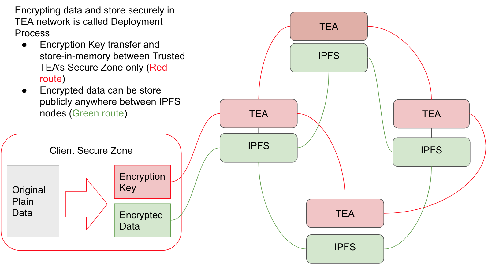

## The TEA Project's Two Layer Setup for Faster Dapps

TEA stands for **T**rusted **E**xecution and **A**ttestation. The TEA Project uses consensus not to confirm the result of the dApp's code; it instead uses consensus to verify the execution environment where the code was run. The TEA Project's philosophy is that **if the execution environment, code, and input data are trusted, then the execution result can also be trusted.**   

The TEA Project aims to build a platform that allows code and data to run inside TEA modules with complete trust. The technologies built into the TEA platform protects the data and makes sure:

- The computation is based on the expected code and expected data. No one can alter the input code, the input data, or the output result.
- The computation's result is correct given the computing environment is verified and there's no data breach during the whole process.

The TEA Project has made completely trustable nodes on its layer-2 possible through the following factors:

-  TEA nodes connect to each other through a peer-to-peer network.
-  Every TEA node is protected and monitored by a hardware TPM chip that provides PoT (Proof of Trust) data. 
-  Every TEA node can verify any other TEA node's integrity through a remote attestation process. The verification is controlled and determined by blockchain smart contracts.
-  Anyone outside the TEA module's hardware has no access to what's inside the module. In addition, neither the TEA node's owner nor the TApp developer can predict which node is running or will run any particular task.
-  After the task is done, anyone can verify the Proof of Trust data of how their code or data was processed.

## The TEA Project's Layer-1
TEA's layer-1 blockchain is responsible for the security and overall trust of the TEA Project. Layer-1 keeps trust certificates on all the nodes running on layer-2. Each layer-2 node must be in good standing based on the information reported by the node's TPM chip under the watch of remote attestation. 

TEA uses its layer-1 blockchain to provide:

 - Economic incentives and penalties that form the basis of its token economy.
 - Immutable trust information storage, such as credit history (incentives and penalties for nodes governed by smart contracts) as well as Proof of Trust information (key IDs, and hashes).
- Block verification / maintain the block height as a universal clock between TEA nodes.

The immutable trust information stored in TEA's layer-1 blockchain is used in the remote attestation process. This process is used in conjunction with the TPM chips onboard the mining computers to ensure each node is trustable:

1. Multiple nodes are randomly called to conduct remote attestation on any particular node under inspection.
2. The results of these remote attestations are stored in the layer-1 blockchain as Proof of Trust (PoT) data.

Successful remote attestation on a candidate node ensures that the machine's TPM chip hasn't been tampered with. Therefore, the secure enclave overseen by the TPM chip is trustable and will protect the confidentiality of both the code and data processed within the enclave. This is the fundamental premise of the TEA Project's concept of **trust**. If a node shows full integrity under remote attestations performed by multiple peer nodes, then its enclave is secure, and the resulting calculations (i.e. app output) can be trusted.

## How TEA's Layer-1 Conducts Remote Attestation
In the TEA network, each trusted computing node has a Root of Trust (RoT): a key pair generated by the TPM manufacturer. The private key for this RoT is held inside the hardware and not known to anyone, including the manufacturer. The public key is disclosed and recorded on the blockchain. Periodically, the blockchain will run remote attestation by requesting a computational node to generate its hardware fingerprint and fingerprints for all the software modules running in the node. These will need to be signed by the TPM's private key before being returned as a response to the attestation request. Each attesting node would verify the signature and the Proof of Trust (PoT) data returned. 

TEA's layer-1 consensus protocol randomly selects remote attestation nodes on layer-2 to challenge the randomly selected node (also on layer-2) being tested. If a  two-thirds (2/3) majority of remote attestation nodes receive a positive result from verifying the target node's requested attestation material, the tested node will have passed the consensus verification and be marked as trustable to use. Note that trustable nodes are the only ones selectable to perform the remote attestation process. Therefore, as long as the network can keep a minimum ratio of 2/3 trustable nodes, we can trust the consensus result. To maintain this minimum threshold, the TEA Project team will initially bootstrap the network with clean nodes and control the birth rate of new nodes (i.e. control the issuance of Camellia NFTs needed to mine on the TEA network).

The results from all attesting nodes will run through the blockchain's consensus protocol before a final decision is made on whether the computing node still meets all the security requirements for it to remain on the network. Finally, the result of the attestation process is recorded on the layer-1 blockchain. 

The different layers of software running in the computational node generate their own secrets, one after another, each using the parent layer's key pairs so that all of them can pass cryptographic verification. These nodes together form a trust chain, with the root of the chain being the hardware RoT. Because the public key of the RoT is stored in the blockchain publicly, anyone can easily verify any derived secrets by tracing back the chain of trust and confirming the RoT using data recorded on the blockchain.

## The Technical Implementation of the TEA Project's Layer-1 Blockchain
We have developed our layer-1 blockchain using Substrate as the provider. But TEA can work with any layer-1 blockchain that has smart contract support will work with TEA, such as Ethereum. It can also run as a parachain in the Polkadot / Kusama ecosystem. As a parachain, the TEA Project would become a middleware layer for other projects needing to farm out secure computing tasks that would otherwise require centralized cloud computing.

- Chains such as Ethereum that are not based on Substrate will need some kind of smart contract (as in a bridge) to link messages between the chains at low-bandwidth and transfer funds (at the expense of gas fees from the connected chain).
- For Substate-based chains, the TEA Project's layer-2 can communicate with the Substrate-based layer-1 chain using XCMP. XCMP, or **Cross-Chain Message Passing**, is based on XCM, or **Cross-Consensus Message Format**, and is a method for Substrate-based chains to communicate with each other.

We chose Substrate because it's modern, fast, release-ready, and written in Rust and WASM (the same tech that the TEA Project is built on). Like Polkadot, the TEA Project uses the **GRANDPA** consensus algorithm for block finality. GRANDPA achieves consensus using asynchronous Byzantine fault tolerance (aBFT), allowing messages to be received and re-broadcast across all nodes before they are committed. This allows nodes to recover from potential message loss and is a robust BFT consensus algorithm for asynchronous networks. 

## The Delegation Chain Builds the Trust Chain Between TEA's Layer-1 & Layer-2
The delegation chain is a network protocol between each TEA node's HSM to transfer trusted computing tasks securely. It uses multiple parties to conduct remote attestation to ensure that data is only transferred among verified trusted hardware modules.

-   A client sends secure data or code to a trusted TEA node as a delegator. If the client doesn't trust any other nodes, they would be best served to own a TEA node to act as a delegator for their own data or code.
-   A delegator will be looking for qualified executors among all the TEA nodes in the IPFS p2p network. Remote attestation is done between each node before exchanging any sensitive information.

Data or code will be transferred via a **repin** to a new delegator (called a **pinner**) to host or an executor to run.

-   No matter where the data or code goes, the proof of delegation data will be attached at each step, forming a delegation chain.
-   Anyone can verify the delegation chain to ensure the chain is valid. Any hacks in the middle would be easily discovered via the blockchain.
-   TEA's layer-1 blockchain will be used to do the verification. Any incentives or punishments is then applied to the participating nodes.

The trust chain starts from the hardware-based trust data (from the hardware security modules like TPM) that's stored in the layer-1 blockchain. The trust chain connects the Proof of Trust data up to the layer-2 nodes running the WASM code.

## The TEA Project's Layer-2
TEA's layer-1 is rock-solid for both security and decentralization, but the Byzantine fault tolerance it must perform for its consensus means it's slow. It's an example of why you generally don't want to do computing inside the blockchain: complicated algorithms cannot run in smart contracts due to computational cost and time needed for completion. That's why the TEA Project has evolved a layer-2  to run dApps at full speed while relying on TEA's layer-1 for trust. The TEA Project's dApps are known as TApps. In each TApp running on the network, computation tasks are carried out by layer-2 components using a hardware-based Root of Trust to achieve efficient, trusted computing. 

- Layer-2 nodes (CML nodes) only trust other CML with certificates issued by layer-1. Because the mining nodes have gained trust from the layer-1 blockchain, they can now reach cloud computing performance as layer-2 no longer needs to guard against Byzantine faults.
- Applications run on layer-2 nodes without any knowledge about blockchain and consensus, as if they were running on cloud computing. These apps are seamlessly decentralized by the TEA Project's 2-layer blockchain design.

The importance of the TEA Project's layer-1 is that it keeps track of the trust status of all nodes on TEA's layer-2. The trust certification kept by layer-1 on all layer-2 nodes is how the TEA Project solves the quandary of how to keep apps decentralized while providing them a safe space to run at full speed. Once a node is certified trustable, it can run encrypted app code in its TPM-protected hardware enclave that interacts with encrypted customer data. The system is designed such that neither the miners nor the developers have access to the customer's data or app code once it enters the mining machine's protected enclave.

## TApps Run Full Speed on a Familiar Architecture
Applications can run full speed on the TEA Project's layer-2 because it looks just like a normal three-tier cloud computing architecture from the app's point of view. And developers themselves don't need any special knowledge about blockchain or consensus algorithms to get the decentralization and security benefits inherent in the TEA Project's 2-layer blockchain. They only need to set WebAssembly as their code compilation target, allowing them to use their preferred programming languages. TApps follow the same three-tier architecture prevalent in cloud computing (presentation tier, app tier, and database tier), but TEA Project TApps run fully decentralized.

## The Technical Implementation of the TEA Project's Layer-2 Blockchain

The TPM module of the hosted mining nodes forms an integral part of the layer-2 hardware tech stack. The TPM modules allow a Root of Trust to be established between nodes running on layer-2 and the underlying layer-1 blockchain that keeps the nodes' Proof of Trust data. The TPM chip also provides the protected enclaves in the layer-2 mining nodes where encrypted code and data are executed by the decentralized TApps of the TEA Project network.

TEA's data storage uses IPFS/libp2p to form a peer-to-peer network. Because IPFS is publicly accessible, storing data on IPFS means everyone can access it as long as the content identifier (CID) is known. In order to protect the data, everything TEA stores in IPFS needs to be encrypted. The encryption key will never be stored in IPFS or any persistent media. It resides only in the memory of the TEA modules.

TEA's runtime environment is WebAssembly (WASM) that is specially configured to run inside a secure enclave. WASM is the only code allowed to run in the TEA runtime, as WASM bytecode is considered one of the most secure form of executables.

Only minimized operating system is run (we currently use a modified version of a minimized NixOS). One important change from the stock distribution is that vSockets have replaced the TCP/IP networking stack. This means that the secure enclave cannot initiate or accept inbound/outbound internet traffic when processing a client's task.

Economics-wise, using a blockchain to record trust information of computation nodes and using VRF to randomly select which node will lead the execution of a client's computation job ensures that it would be very costly to attack the TEA network. We use token incentives to encourage many participants to run a node themselves or stake their tokens with trusted nodes. The token staking mechanism uses economics to reinforce well-behaving nodes. 

## Trust Allows WebAssembly Code to Run Full Speed
As the TEA Project's layer-1 verifies the trustable status of each node, developers can run their decentralized apps at native speeds on layer-2. At the application layer, it's only strictly required that developers use WebAssembly (WASM) to deploy code to the TEA runtime. The security built into the WebAssembly language itself also helps to secure the network. Using WASM is also conducive for developing applications in the TEA ecosystem. Most modern programming languages can be compiled into the WebAssesmbly code format. Developers can stick with their preferred programming languages to write their apps which speeds up development on the TEA platform.

TEA Project's layer-2 currently uses the file storage and networking services provided by IPFS. Any current IPFS miner can begin participating in the TEA network by adding a TEA hardware security module (such as a Raspberry Pi with a TPM chip).

### Further Technical Reading on TEA's Layer-1 Blockchain
- For more information on the TEA Project's proof-of-stake consensus algorithm that's built on Substrate (the consensus algorithm that Polkadot also uses): https://medium.com/polkadot-network/polkadot-consensus-part-1-introduction-3e3cd6237243
- For more technical details on how TEA's layer-2 can communicate with another Substate-based chain functioning as its layer-1: https://wiki.polkadot.network/docs/learn-crosschain

### Further Technical Reading on TEA's Layer-2 Blockchain
- For more information on how code and data travels along IPFS while remaining secure in the TEA Project: https://teaproject.medium.com/turn-ipfs-file-system-into-ipfs-function-as-a-service-25dbcaff3975
- For an overview of how mining nodes interact and share code and data: https://teaproject.medium.com/tea-project-pinning-and-re-pinning-in-practice-9886e147e5ca
- To learn more about TEA's 3-tier decentralized architecture: https://teaproject.medium.com/the-tapps-3-tier-decentralized-tech-stack-43d2872f609b