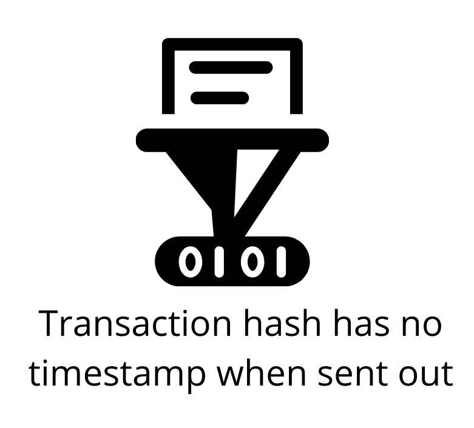

## TEA: Two Layers of Consensus for Faster Dapps
The TEA Project's goal is to build a platform that allows code and data to run inside TEA modules with complete trust. The technologies built into the TEA platform protects the data and makes sure:

-   The computation is based on the expected code and expected data. No one can alter the input code, the input data, nor the output result.
-   The result of the computation is correct given the computing environment is verified and there's no data breach during the whole process.

The TEA Project has made completely trustable nodes on its layer-2 possible through the following factors:

-   TEA nodes connect to each other through a peer-to-peer network.
-   Every TEA node is protected and monitored by hardware TPM chips or the CPU's TEE (Trusted Execution Environment). The TPM can provide PoT (Proof of Trust) data. If utilizing the CPU, the CPU's TEE will rely on the manufacturer's verification.
-   Every TEA node can verify any other TEA node's integrity through a remote attestation process. The verification is controlled and determined by blockchain smart contracts.
-   Anyone outside the TEA module's hardware is ZK (zero-knowledge) about what happens inside the module. Neither the TEA node's owner nor the server connected to the module can predict which node is running or will run any particular task. .
-   After the task is done, anyone can verify the workflow.

## Trust Allows WebAssembly Code to Run Full Speed
As the TEA Project's layer-1 verifies the trustable status of each node, developers can run their decentralized apps at native speeds on layer-2. At the application layer, it's only strictly required that developers use WebAssembly (WASM) to deploy code to the TEA-runtime. The security built into the WebAssembly language itself also helps to secure the network. Using WASM is also conducive for developing applications on the TEA ecosystem. Most modern programming languages can be compiled into the WebAssesmbly code format. Developers can stick with their preferred programming languages to write their apps which speeds up development on the TEA platform.

TEA Project's layer-2 currently uses the file storage and networking services provided by IPFS. Any current IPFS miner can begin participating in the TEA network by adding a TEA hardware security module (such as a Raspberry Pi with a TPM chip).

## Layer-2: Maintaining Consensus

The design of the TEA Project's layer-2 consensus ensures that even if transactions are missing (e.g. the transaction is delayed by network congestion), the ordering of transactions will still be correct. The TEA Project is able to achieve a reliable ordering of transactions through its use of replicas and CRDT databases.

- Delegators send **transaction hashes** and **transaction receipts** to multiple replicas. These followup receipts have timestamps that show when the original tx hash was sent out.
- Replicas match the hashes of transactions with their followup receipts. Replicas can re-order transactions as long as they remain within a period of time relative to the now time of the replica's clock.
- A decentralized, peer-to-peer sync function between replicas keeps a CRDT database of ordered transactions among all replicas. Because it's **conflict-free**, the sync function can only add a missing transaction hash to a replica when it's missing on their ledger compared to other replicas on the network.

## How Transactions are Generated & Processed Through the TEA Network

Because it takes time for a delegator to package up a transaction and create its hash, this transaction doesn't have a timestamp of when it was sent out.

You can imagine the delegator sealing the envelope of the transaction before sending it out to other replicas on the network. Since the envelope is sealed, there's no way to include the sent timestamp within the envelope.