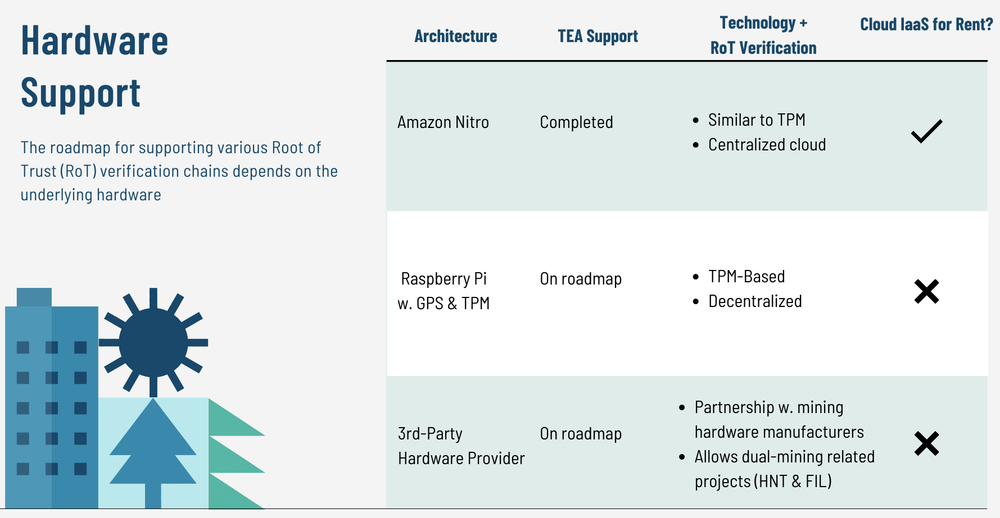

# 3.1 Proof of Trust / TPM

The primary objective of the TEA Project's layer-1 is to maintain the trusted status of all nodes on layer-2.  These nodes that gain trusted status through attestation on layer-1 no longer have to ensure Byzantine Fault Tolerance (BFT). 

The apps can run full speed on layer-2 once trust among nodes can be taken for granted. This is in contrast to traditional blockchain apps which, because they run on the blockchain directly, need to perform BFT consensus. This is a roadblock for traditional blockchain apps looking to perform at scale while maintaining decentralization and security. Conventional blockchain is hamstrung by the two prevailing roots of trust, cryptography and consensus algorithms. The TEA Project creates a third possibility, a hardware root of trust, through cheap security modules like the TPM chip.

## Sources of Truth: Blockchain, Hardware and Time

The TEA project relies on three sources of trust: the blockchain, hardware, and GPS satellites.

Every node stores its essential data to the blockchain. Based on the blockchain's secure nature, the data stored in the blockchain is considered trustable. When performing remote attestation, the verifier won't trust anything the attester claims; everything needs to come from either the historical data in blockchain or the hardware signed message. All other decisions are made based on those two sources of truth. 

The TEA Project can use trusted execution environments like Amazon's Nitro or a hardware security module (HSM) like TPM as a source of trust.

- For Amazon Nitro, the validation is centralized and requires no further consensus.
- For hardware security modules like TPM, there are still known vulnerabilities. Since TPM alone is not secure enough, a delegation chain is created on the network for a remote attestation workflow. 

## Making Secure Mining Hardware Affordable Improves Decentralization

As opposed to crypto projects that require miners to have expensive CPU, GPU, ASIC, hard disk drives, or other expensive computing equipment, miners operating on the TEA Project network can use single-board computers as long as they have a TPM security chip and a GPS module. A typical mining machine capable enough to run on the TEA network can be setup for less than $100. TEA Project miners won't need to engage in high-energy complex cryptographic computing to run consensus algorithms. Making TEA Project mining affordable and accessible to the general public helps improve decentralization by making mining within reach for more regions of the world.

## Leveraging Hardware Security Modules for Trust

The TEA Project works with existing secure hardware technologies like the Trusted Platform Module (TPM) to add a trusted layer to its blockchain. Each node on the TEA network must have a hardware security module (HSM). To be able to run decentralized apps and execute code, these decentralized nodes must pass remote attestation when queried by existing trusted nodes on the network.

The remote attestation process queries the embedded HSM on the candidate node, and its embedded HSM (such as a TPM chip) will respond to the query. If the result is as expected, then the candidate node gains trusted status. The result of the remote attestation process is stored on the blockchain.

Once a node is trusted, it can carry out computations for TEA Project apps within its secure enclave. The TEA Project's major premise regarding trust is that if we can trust the the node through remote attestation, we can trust the integrity of its secure enclave to run code and process data in a way that's secure and zero-knowledge.

## TEA Project Hardware Support

The TEA Project's roadmap for supporting various Root of Trust (RoT) verification chains depends on the underlying hardware.

# 3.2 Proof of Time/GPS
## Transaction Consensus Using Time

According to the needs of their specific business logic, TApp applications running on the TEA network have two state categories:

1. A strong-consistency state machine based on Proof of Time.
2. An eventually consistent CRDT database built on OrbitDB that can be used ad hoc by TApps.

### The Strong Consistency State Machine

The first state category based on proof of time is for transactions requiring strong consistency, which would govern transactions involving funds and accounting. Using the time stamps from navigation satellites under watch of hardware attestation, our strong consistency state machine can achieve continuous state updates at a small synchronization cost. The TEA Project is continuous as it has no concept of blocks, and it’s able to sync nodes at very little cost as it has no PoW puzzles to solve and doesn't have to periodically stop and wait for all nodes to sync before continuing.

The complexity of the TEA Project's strong consistency state machine lies in synchronizing the current state between multiple nodes. Because we do not want to use the traditional blockchain consensus algorithms to achieve strong consistency, the most crucial task is ensuring that the transaction sequence is consistent across all replicas. We do this by relying on the accurate time provided by the atomic clock of GPS satellites. 

The reported time is recognized under the supervision of trusted TPM chips and used as the basis for the final ranking of all replicas. It's not necessary for all nodes to periodically reach a consensus on the latest block. But to ensure that most replicas can be synchronized to a consistent state, the TEA Project’s state machine requires a short waiting queue due to network latency.  Since time is stable in our universe, it follows that each replica can achieve strong consistency using non-BFT consensus as the possibility of Byzantine faults has already been handled by the layer-1 blockchain.

### The Eventually Consistent CRDT Database

The other state category is a CRDT database that allows for short-term inconsistencies in the business logic of TApps. The TEA Project uses OrbitDB databases built on top of IPFS for these transactions.

CRDT stands for conflict-free replication data type, which allows conflict-free mergers between different replications before ultimately achieving network-wide consistency. In fact, the business logic of most apps can tolerate short-term inconsistencies to achieve both decentralization and efficiency. A typical example of a traditional cloud app that deals with this issue gracefully is Google Docs.

The TEA Project uses CRDT databases because they are cheap and fast.

- CRDT is fast as it has no time delay and doesn’t need to wait for others. Allowances are made for new transaction reports which are added non-destructively. This is in contrast to the TEA Project’s strong consistency state machine which must wait a minimum amount of time for confirmation.
- CRDT storage cost is cheap, relying on IPFS for decentralized hard drive storage instead of the more expensive RAM storage.

# 3.3 Layer-2 Consensus
## How Layer-2 Maintains Consensus - CRDT Databases

The design of the TEA Project's layer-2 consensus ensures that even if transactions are missing (e.g. the transaction is delayed by network congestion), the ordering of transactions will still be correct. The TEA Project is able to achieve a reliable ordering of transactions through its use of replicas and CRDT databases.

- Delegators send **transaction hashes** and **transaction receipts** to multiple replicas. These followup receipts have timestamps that show when the original tx hash was sent out.
- Replicas match the hashes of transactions with their followup receipts. Replicas can re-order transactions as long as they remain within a period of time relative to the now time of the replica's clock.
- A decentralized, peer-to-peer sync function between replicas keeps a CRDT database of ordered transactions among all replicas. Because it's **conflict-free**, the sync function can only add a missing transaction hash to a replica when it's missing on their ledger compared to other replicas on the network.

Because it takes time for a delegator to package up a transaction and create its hash, this transaction doesn't have a timestamp of when it was sent out.

You can imagine the delegator sealing the envelope of the transaction before sending it out to other replicas on the network. Since the envelope is sealed, there's no way to include the sent timestamp within the envelope.

## How Layer-2 Maintains Consensus - Strong Consistency State Machine
The above is an explanation of how consensus occurs for our NoSQL CRDT database that runs through our B CML mining nodes. In contrast, our strong consistency state machine that runs through A CML mining nodes doesn't need any consensus as there are no new blocks to wait for. Instead of blocks, new transactions land on a conveyor belt and eventually everyone ends up with the same state. This state machine functions just like a database, and its technological design gives the TEA Project a potentially limitless TPS.

The TEA Project's state machine only needs to store these state change in RAM and not the transaction itself. Since the on-board TPM chips of the mining nodes allows attestation to be run on them, they can be guaranteed to be trustable and don't need to sync up a historic ledger of all previous transactions. Once all nodes are trustable, any node can get the latest state from a nearby node's RAM. Syncing up to the latest state through reading a nearby node's RAM is a quick process, much quicker than having to reconstruct the entire ledger to get the latest block. 

In the TEA Project:
- Transactions are processed with the resulting state change stored in the RAM memory residing in the enclave of A CML mining nodes. 
- Only A nodes run the strong consistency state machine (including the sql database instance).
- Every A node will have the same copy of the state in their memory.
- There's also a persistent backup kept to IPFS but in an encrypted format.

## Two State Machines = Better for Developers

Developers will have a choice when developing their decentralized apps on the TEA Project:

- The NoSQL CRDT database that runs through B CML and uses OrbitDB for storage on IPFS.
- The GlueSQL database that uses the on-board GPS modules of A CML to update the current state continuously. IPFS is only used to write backups of the current database state. The GlueSQL database can be used by developers the same as they use SQL databases in the cloud computing world.

The GlueSQL state machine is more expensive and appropriate for more complex app interactions. In an effort to keep costs down, application developers can allocate more complex database queries to A CML nodes while using the CRDT database running through B CML nodes for less important tasks.
