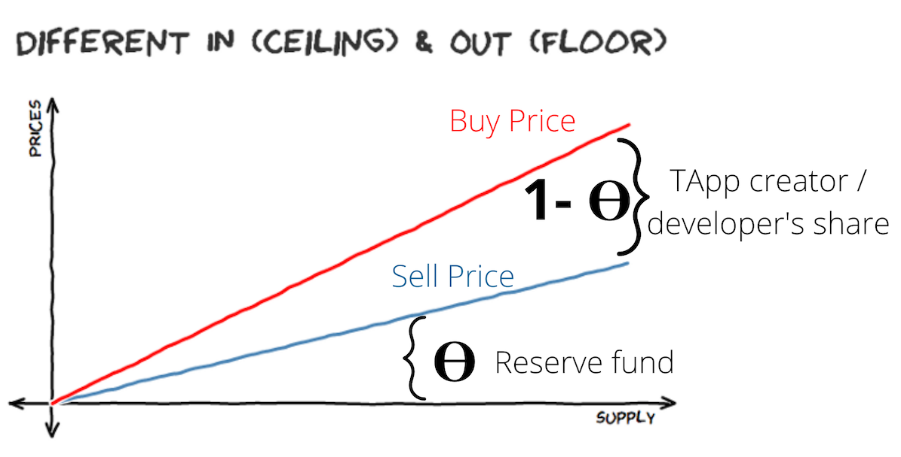

## TApp Bonded Token Sales
The TEA Project offers decentralized app developers the ability to raise funding through the sale of **TApp tokens**. Each TApp can have an ERC20-compatible fungible token associated with it in order to raise funds and reward those who wish to invest in the project. 

Whoever holds a TApp's tokens owns some percentage of the project. These tokens tokenize ownership of the project and are a claim to revenue dividends distributed to the project's stakeholders. The token availability for a TApp allows for users of the TApp to become investors in it.

## TApp Tokens: Bonding Curves
TApp tokens follow a bonding curve where price programatically increases as supply increases. A TApp's tokens can be traded in to its bonding curve (buy or sell) at any time for TEA tokens. These tokens can also be traded outside of the Tea Project as a standard ERC20 token.

Every bonding curve has a theta value, also known as the reserve rate. The theta value determines how much of every payment into the bonding curve is reserved for the bonding curve. In the picture below, **theta x gross TEA amount** of every buy into the bonding curve goes into the reserve fund (the area under the blue line). This ensures that everybody who buys into the bonding curve can sell back into it. The sell line will take time to move higher than the buy line for any token purchase, which incentivizes investors to hold the token.

The area between the red **sell** line and the blue **buy** line in the graphic above is the portion that goes to developers from any funds going into the bonding curve. This is considered the developer's **funding pool**, a floating source of capital that is used to pay developers, licensing costs, or any other expenses related to the development of the TApp. As an example, a TApp's creators might have a bonding curve where the token's price = supply^2 with a theta (reserve rate) of 0.9, keeping (1 - .9) = 10% for their own development expenses and salaries.

## Bonding Curve Mechanics
The TApp token bonding curve has two different token payout algorithms depending on who supplies the funds into the bonding curve.
1. **A TApp user**: A TApp user pays TEA tokens in order to use a TApp. After the TApp owner takes their slice (TEA paid x (1 - theta), the rest of the TEA tokens are sent to the bonding curve to mint new TApp tokens. Since the user has already received utility from the TApp, they don't get any tokens in return. These newly minted tokens resulting from the user paying into the app are thus distributed to the existing token holders as a dividend. Therefore when a TApp gets used, the token holders get a dividend and the token price goes higher from the boost in token supply. 
2.  **A TApp token investor**: A TApp token investor is someone who simply buys tokens as an investment. The investor payment starts off a process similar to when someone uses the TApp: the TApp owner is given their portion (TEA paid x (1 - theta), and the rest of the TEA tokens paid by the investor are sent to the bonding curve to mint new TApp tokens. The newly minted TApp tokens are sent to the investor's wallet, with the existing token holders only benefiting from the rise in the token price (no dividend is paid to them in this scenario).

Miners are also given token dividend payouts during app usage if the TApp creator elects for miners to receive staked tokens in exchange for their hosting. Staked tokens are unique to miners and cannot be sold. They function as rights to dividend payments when the TApp is used. For example, if the TApp creator has set aside 10 tokens for each miner hosting their TApp, then a miner will receive dividends equal to the amount as if they held 10 real tokens.

## TApp Tokens Help Onboard New Users
Because TApp token sales are a great vehicle for project teams to get funding, it benefits them to advertise their token sale to the public. Every time someone uses their TApp is another opportunity for the TApp to win over a possible investor. 

Consumers of TApps are likewise incentivized to promote TApps they find useful. After buying into a TApp's tokens, they can then promote these TApps on social media in an effort to get others to invest in the TApp or use it themselves. Either action will increase the supply of the token and therefore its price. 

The TApp token economy acts as another path towards onboarding new users into the TEA Project's ecosystem. Consumers interested in TApps will exchange ETH to buy TEA which in turn will support the TEA token price and grow the TEA economy.