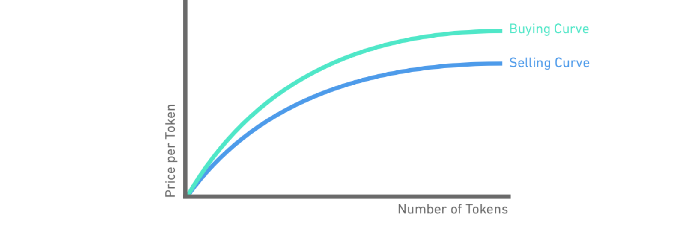

## 5.1 TApp Bonded Token Sales
The TEA Project offers decentralized app developers the ability to raise funding through the sale of **TApp tokens**. Each TApp can have an ERC20-compatible fungible token associated with it in order to raise funds and reward those who wish to invest in the project. 

Whoever holds a TApp's tokens owns some percentage of the project. These tokens represent tokenized ownership of the project and are a claim to revenue dividends distributed to the project's stakeholders. Making a token available for a TApp allows its users to become investors in it.

## TApp Tokens: Bonding Curves
TApp tokens follow a bonding curve where price programatically increases as supply increases. A TApp's tokens can be traded into its bonding curve (buy or sell) at any time for TEA tokens. These tokens can also be traded outside of the Tea Project as a standard ERC20 token.

Every bonding curve has a **Theta** value, which is the percent of every token buy or consume event that's used to fund the development of the TApp. If **theta** is set at .2 (20%), then 1 - .20 = .8 is used to fund the sell side of the bonding curve (80%). The smaller the number for **theta**, the closer the buy and sell prices are on the bonding curve.

An important innovation, the bonding curve design makes sure that there's a reserve fund backing the TApp tokens. This ensures that everybody who buys into the bonding curve can sell their tokens back into it. The sell line will take time to move higher compared to the buy line for a token purchase at any point in time, which incentivizes investors to hold the token.

The area between the blue **sell** and the green **buy** curves in the graphic above is the portion that goes to developers from any funds going into the bonding curve. This is considered the developer's **funding pool**, a floating source of capital that is used to pay developers, licensing costs, or any other expenses related to the development of the TApp. As an example, a TApp's creators might have a bonding curve where the token's price = supply^2 with a theta of 0.03, meaning that 3% of every TApp token buy or consume event into the app for their own development expenses and salaries. The other portion, (1 - .03) = 97%, is put directly into the reserve pool and bonded directly into the bonding curve.

## Bonding Curve Mechanics
The TApp token bonding curve has two different token payout algorithms depending on who supplies the funds into the bonding curve.

1. **A TApp user**: A TApp user pays TEA tokens in order to use a TApp. After the TApp owner takes their slice (TEA paid x theta), the rest of the TEA tokens are sent to the bonding curve to mint new TApp tokens. Since the user has already received utility from the TApp, they don't get any tokens in return. These newly minted tokens resulting from the user paying into the app are thus distributed to the existing token holders as a dividend. Therefore when a TApp gets used, the token holders get a dividend and the token price goes higher from the boost in token supply. 
2.  **A TApp token investor**: A TApp token investor is someone who simply buys tokens as an investment. The investor payment starts off a process similar to when someone uses the TApp: the TApp owner is given their portion (TEA paid x  theta), and the rest of the TEA tokens paid by the investor are sent to the bonding curve to mint new TApp tokens. The newly minted TApp tokens are sent to the investor's wallet, with the existing token holders still benefiting from the rise in the token price as no dividend is paid to them in this scenario.

Miners are also given token dividend payouts during app usage if the TApp creator elects to give miners staked tokens in exchange for their hosting. Staked tokens are unique to miners and cannot be sold. They function as rights to dividend payments when the TApp is used. For example, if the TApp creator has set aside 10 tokens for each miner hosting their TApp, then a miner will receive dividends equal to the amount as if they held 10 real TApp tokens.

## Developers Funding
Developers can use TEA Project’s built-in bonding curve to generate investment in their TApp. This funding mechanism allows TApps to leverage expected future revenue into early development funding. The TAppStore is where the entire TEA ecosystem meets: developers to publish their TApps, miners can find the next TApp to invest their harvested TEA tokens, curators to publicize and invest in new trending TApps, and consumers to spend their TEA tokens on useful TApps they want to use.

## TApp Tokens Help Onboard New Users
Because TApp token sales are a great vehicle for project teams to get funding, it benefits them to advertise their token sale to the public. Every time someone uses their TApp is another opportunity for the TApp to win over a possible investor. 

Consumers of TApps are likewise incentivized to promote TApps they find useful. After buying into a TApp's tokens, they can then promote these TApps on social media in an effort to get others to invest in the TApp or use it themselves. Either action will increase the supply of the token and therefore its price. 

The TApp token economy acts as another path towards onboarding new users into the TEA Project's ecosystem. Consumers interested in TApps will exchange ETH to buy TEA which in turn will support the TEA token price and grow the TEA economy.

## 5.2 The 3-Phase Rollout
The TEA Project will use a 3-phase rollout that encompasses miners, developers, and consumers in exactly that order. A strong mining community must be developed to provide the infrastructure before developers are onboarded. Simularly, developers must develop compelling apps before consumers can be enticed to enter the ecosystem.

Each demographic will be encouraged to enter the TEA Project through a variety of methods.

#### 1. Miners
 
The TEA Project aims to build a healthy ecosystem by starting with the miners. Miners harvest TEA tokens from hardware mining with CML. 

- Miners "plant" CML into their mining hardware equipped with a TPM chip and a GPS module.
- Mining machines host Web3 applications and are rewarded in TEA token based on the app's consumed computing resources.

 Miners are also able to exchange TEA in a liquid market with relative price stability as well as Miners can burn TEA to buy more CML. Through the self-interest of maximizing profit for their mining machines, the miners create the infrastructure necessary for the demographic in the next stage of our rollout, the developers.

#### 2. Developers
 
 After miners have built up the actual computing infrastructure, the focus shifts to onboarding developers. This segment of the rollout will include tech education & outreach on how to build on the TEA ecosystem. 
 - Hackathon events and grant program released.
- TEA SDK available helping developers build with the TEA dev framework.
- TApp store launched showcasing rich dApps running on the TEA platform.
  
Miners invest their TEA into TApp tokens which supports both early developers & TEA token price. Additionally, app revenue rewards the app developer, the hosting miners, and our next segment of users, the consumers.

#### 3. Consumers
 
After miners and developers, next up is the consumer outreach phase. The rich TApps available in the TApp store are now marketed to consumers.  We hope to see a positive feedback loop: as more consumers enter ecosystem, devs can see what apps consumers want. The devs then focus on making TApps that meet consumer demand, and popular TApps financially reward both miners and developers.

Additionally,  consumers can invest in each TApp through its bonding curve and promote the TApp on social media. Becoming a curator for a burgeoning TApp helps the consumer (their TApp tokens they hold will increase in price along the bonding curve as more buyers push the supply higher). Their curation will also help the platform become better known on social media, which again shows how self-interested action within the TEA Project benefits the ecosystem on the whole.

## Further Links on Ecosystem Development, Bonding Curves, and TApp Tokens
- [How Devs & Miners Support Each Other in the TEA Project Economy](https://www.youtube.com/watch?v=WUV_SVMTgT0). An explainer video about how the various participants work together on the TEA Project platform.
- [Bonding Curve Theta](https://github.com/tearust/teaproject/wiki/Bonding-Curve-Theta) determines what percentage of consume actions and TApp token purchases goes directly to the TApp developers.
- [TApp Token Supply and Demand](https://github.com/tearust/teaproject/wiki/TApp-Token-Supply-and-Demand) details how supply and price are correlated along the bonding curve.
- [Staked TApp Tokens](https://github.com/tearust/teaproject/wiki/Mining:-Staked-TApp-Tokens) detail how miners are paid out in TApp tokens for hosting any particular TApp.
- [TEAfluencer TApp](https://www.youtube.com/watch?v=K3HABowFwhg) gives a good overview on how potential users would invest in a TEAfluencer TApp.

