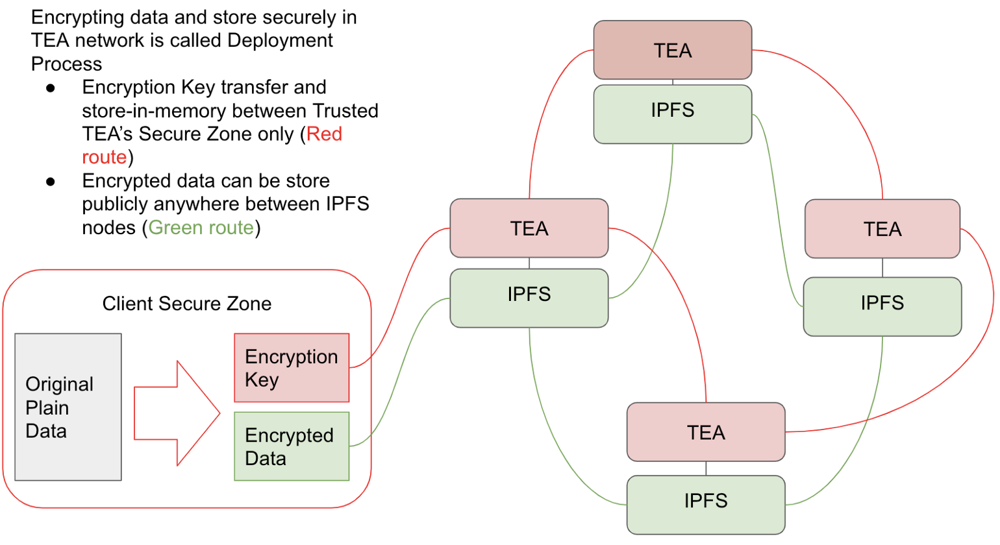

      

When an IPFS client requests a CID from the IPFS network, the client can easily verify the content by verifying the hash.

Since you don't know the hash of the correct result, you cannot verify using the traditional way, and you don't need to. What you can verify is the Proof of Trust (we call it PoT, Tea-Pot). The PoT is simply a series of valid proof of how your code or data is processed in the T-rust network. The math and silicon physics protects the computation process so that as long as you can verify the PoT, you can trust the correctness of the result.

>> in other words >>

On the other hand, the result of code execution is unknown. You cannot verify the hash of the result to determine its correctness. In TEA, we do not verify the hash of the result, only the hash of PoT (Proof of Trust). This is done in the layer-1 blockchain. Only validated TEA nodes are allowed to host your code or data (called pinning in TEA nomenclature). Among those hosts, only VRF selected executor will actually run your code. The whole workflow is monitored by blockchain smart contracts.
  

TEA modules' CPU run plain format of code because as long as the encrypted code enter the hardware protected TEA module, it will meet the encryption key there. The computer code is decrypted and then the data is run inside this protected environment.
  

The delegation chains consensus distributes the key to other safe location during the "deployment workflow". Stated another way, qualified TEA modules can "pin" or "host" your code / data before it's actually allowed to run your code. The "qualification" process is called delegation and it happens in the layer-1 blockchain.

